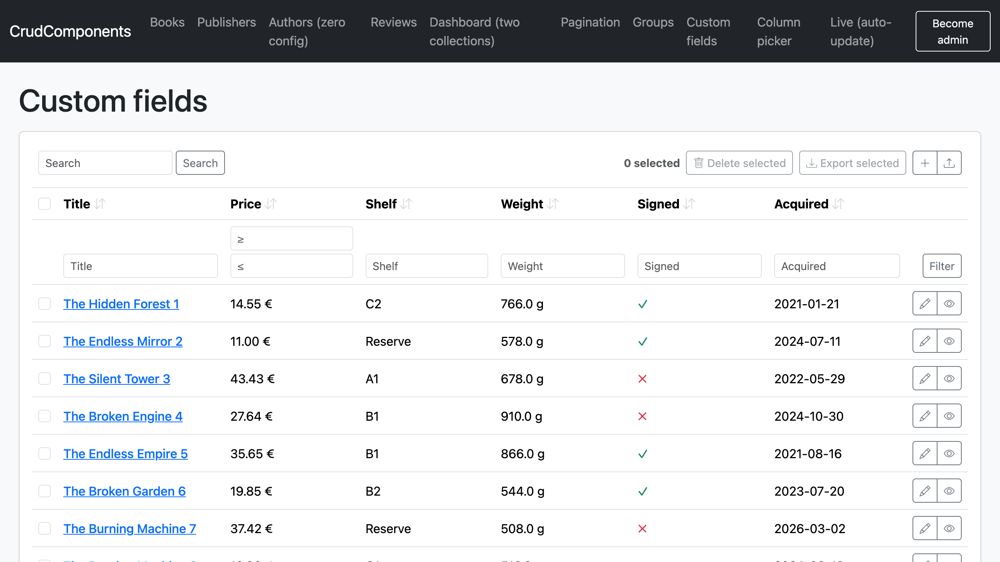
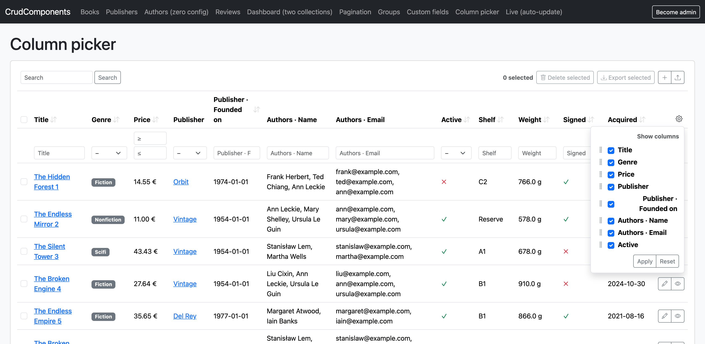
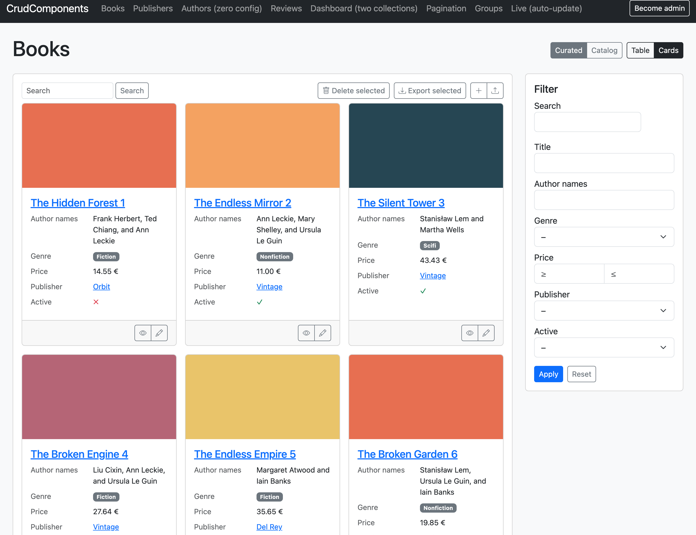

# CrudComponents

> **AI disclaimer:** This Gem is developed with the help of Claude. It is architected and reviewed by me, but the code is generated by Claude.

Declarative CRUD UI for ActiveRecord models, primarily for admin backends — rendered
**inside your app**: your layout, your routes, your authorization, your styling, mixed
freely with hand-written pages. Not an admin island with its own theme and navigation.

The core promise: **zero configuration already works.** A bare ActiveRecord model
renders as a usable, filterable, sortable table in one line. Configuration only ever
*improves* what you get — it never has to *enable* it, and removing any line of config
falls back to a sensible default.

```erb
<%= crud_collection Book.all %>
```

That line gives you a table with type-appropriate cells, sortable headers, an inline
filter row, and working URL params — `?genre=scifi&price_leq=20&sort=title&dir=desc`
filters and sorts it, with or without JavaScript. No controller code, no model code.

## Installation

```ruby
# Gemfile
gem 'crud_components'
```

Requires Rails >= 7.1 and Ruby >= 3.2.

Optionally, run the installer for an initializer for simple styling
and optional Stimulus (JavaScript) controllers. (progressive enhancement; everything works without them):

```sh
bin/rails generate crud_components:install
```

## The running example

A small bookstore, used throughout the docs:

```ruby
class Book < ApplicationRecord
  belongs_to :publisher
  has_many :reviews
  has_and_belongs_to_many :authors
  has_one_attached :cover
  enum :genre, { fiction: 0, scifi: 1, nonfiction: 2 }
  # columns: title, subtitle, slug, blurb (text), price (decimal),
  #          pages (integer), published_on (date), active (boolean)
end

class Publisher < ApplicationRecord; has_many :books; end           # name, slug, founded_on
class Author    < ApplicationRecord; has_and_belongs_to_many :books; end  # name, email
class Review    < ApplicationRecord; belongs_to :book; end          # rating (int), body (text)
```

## A table in one line


```erb
<%= crud_collection Book.all %>
```

With zero configuration, derived from what Rails already knows:

- every column gets a type-appropriate cell and filter control (see the
[combination table](#the-combination-table));
- `genre` renders as a badge and filters as a select of the enum keys;
- associations become columns automatically — `publisher` (belongs_to) as a
nil-safe link, `authors` / `reviews` (has_many / habtm) as a truncated list
("Tolkien, Lewis +3 more"); Active Storage attachments render by content type —
images inline, a PDF/other file as a preview or an icon + filename (`cover`,
`has_many_attached` sets, …);
- headers come from `human_attribute_name`, so your existing model i18n applies;
- filtering, search and sorting are read from the request params automatically — every
state is a plain GET URL, shareable and bookmark-safe.

A single record and a standalone filter form work the same way:

```erb
<%= crud_record @book %>      <%# definition list, same cell renderers %>
<%= crud_filter Book %>       <%# labelled filter form, e.g. for a modal or sidebar %>
```

The rest of this README is a short "now I want to…" tour. Every step is optional; nothing below is
required for any view above to work. Each section links to its in-depth reference.

## The tour

### Choose the columns

Include the DSL and curate with a **fieldset** — a named selection of fields:

```ruby
class Book < ApplicationRecord
  include CrudComponents::Model
  crud_structure do
    fieldset :default, %i[cover title genre price publisher]   # [] is the off switch
  end
end
```

Curation happens *only* in fieldsets — declaring or customizing an attribute never adds
or removes a column. → [Views & fieldsets](docs/views.md)

### Nicer cells


```ruby
crud_structure do
  # …
  attribute :price, as: :number, unit: '€', digits: 2
  attribute :blurb, as: :markdown                          # uses a markdown gem if present
  attribute(:badge) { |book| tag.span(book.status, class: 'badge') }   # custom markup
  # …
end
```

Built-in renderers are surface-aware; soft-dependency ones (`:markdown`, `:asciidoc`,
`:json` highlighting) use a gem when present. A name Rails doesn't
know falls back to a public model method. → [Fields & rendering](docs/fields.md)

### Filter / sort a computed column

Filtering and sorting happen in SQL, so computed fields declare how — facets live
together in one block:

```ruby
attribute :author_names do
  render { |book| book.authors.map(&:name).to_sentence }
  filter :authors                  # delegate to Author's search_in; or spell it out: filter authors: :name
  sort   { |scope, dir| scope.left_joins(:authors).order('authors.name' => dir) }
end
```

The **search spec** — the mini-language `filter` and `search_in` share — builds joins +
parameterized, wildcard-escaped ILIKE from column/association names, nothing to sanitize.
An association name alone *delegates* to that model's `search_in`. →
[Fields → the search spec](docs/fields.md#the-search-spec)

### Columns the model doesn't know about



User-defined properties that live in a separate store (a definitions/values pair, JSONB,
an API) become extra columns without touching the model — build a `DynamicColumn` per
request and pass `extra_columns:`. A `preload:` lambda batch-loads the page (no N+1); add
`filter:`/`sort:` to make it query like a real column. A column that *is* a domain object
(a mail, a resource) can carry its own header link and bulk actions right in the `<th>` via
`header:` / `header_actions:`. A header action declared `on: :selection` acts on the **ticked
rows** × that column's object (it submits the shared select-form and makes the table
selectable); `on: :collection` is a plain "for all rows" button.

```erb
<%= crud_collection @books, extra_columns: current_account.custom_property_columns %>
```

```ruby
CrudComponents::DynamicColumn.new(:mail_42, label: 'Welcome mail',
  header: -> { link_to mail.name, mail },
  header_actions: [CrudComponents::Action.new(:send, on: :selection, icon: 'send', method: :post) { send_path(mail) }],
  preload: ->(records) { … }) { |record, loaded| loaded[record.id] }
```

→ [Fields → dynamic columns](docs/fields.md#dynamic-columns) ·
[custom headers & column actions](docs/fields.md#custom-headers-and-column-actions)

### Let users pick their columns



Pass `picker: true` and a **gear** appears in the header row: users hide and reorder
the columns they may see, grouped by source model (Pipedrive-style). It submits `?cols[]=` to
the same URL — like sort and filter — so it needs no endpoint, opens and works without
JavaScript (native `<details>`), and is always intersected with the permitted set (a forged
param can't reveal a gated column). By default (`picked_columns: :auto`) the gem reads the
param for you — ephemeral, nothing stored. To persist, resolve the selection in your
controller and pass it back as an Array; the gem then shows exactly that and never re-reads
the param. It's also a standalone helper (`crud_column_picker`) you can drop above a
`crud_record` detail view.

```erb
<%# ephemeral — the gem reads ?cols= %>
<%= crud_collection @books, picker: true %>

<%# persisted — controller stores the pick, view replays it (nil → :auto until the first pick) %>
<%= crud_collection @books, picker: true, picked_columns: current_user.book_columns %>
```

→ [Views → column picker](docs/views.md#column-picker)

### Global search, slugs, display names

```ruby
label :title              # default: name → title → first string column, else "Book #42"
identify_by :slug         # Use slug in the URLs
search_in :title, :subtitle, :publisher   # :publisher delegates to Publisher's search_in
```

`label` + `identify_by` + `search_in` are a model's **identity** — and they define how
*other* models render, link and filter it through their associations. Declare Order's
identity once and every `belongs_to :order` column gets it for free. →
[Fields → identity](docs/fields.md#identity-label-identify_by-search_in)

### Buttons / Actions

`:new`, `:show`, `:edit`, `:destroy` exist by default, **self-disabling** when a route
doesn't resolve or the user isn't permitted. Declare more; the block is the path:

```ruby
action :preview, icon: 'eye' do |book| book_preview_path(book) end
action :import, on: :collection do import_books_path end
```

→ [Views → actions](docs/views.md#actions)

### Different tables on different pages


Use fieldsets to display different sets of fields in different places.

```ruby
fieldset :index,      %i[cover title genre price publisher], actions: %i[preview edit destroy]
fieldset :playground, %i[cover title authors price published_on active]
```

`crud_collection` can be configured with different fieldsets and layouts.

```erb
<%= crud_collection @books, fieldset: :playground %>
<%= crud_collection @books, fieldset: :playground, layout: :cards %>   <%# layout is a separate axis %>
```

Filterability follows the fieldset — **you can only filter and sort what you can see** (a
security property, [below](#security)); `filters:` extends it when a surface wants more
filters than columns. → [Views & fieldsets](docs/views.md#fieldsets)

### Only admins see purchase prices

We use [CanCanCan](https://github.com/CanCanCommunity/cancancan) by default for authorization.

```ruby
attribute :purchase_price, if: :manage      # invisible AND unfilterable for non-managers
```

`if:` takes a symbol (`can?` sugar) or a lambda. A hidden field is hidden *everywhere,
including the query layer*. → [Security → permissions](docs/security.md#permissions)

If you want to use a different authorization library, use a lambda:

```ruby
attribute :purchase_price, if: ->(record) { record.draft? }
```

### Create and edit records


The gem uses [simple_form](https://github.com/heartcombo/simple_form) to render forms. You can override the form rendering by overriding the `_form.html.erb` partial.

```erb
<%= crud_form @book %>          <%# edit if persisted, new if not %>
```

The gem does not own any controllers so it is your responsibility to handle the actions. But the gem provides a permit list for the controller you can use so the two can't drift:

```ruby
params.require(:book).permit(*CrudComponents.permitted_attributes(Book, action: action_name.to_sym, ability: current_ability))
```

`editable:` adds a second permission dimension (you may *see* a field but not *change*
it). → [Forms](docs/forms.md)

### I have 50,000 books


Take the query into your own hands to paginate or compose with a scope:

```ruby
@query = CrudComponents::Query.new(Book, params, ability: current_ability)
@books = @query.apply(Book.accessible_by(current_ability)).page(params[:page])  # kaminari
```

```erb
<%= crud_collection @books, query: @query %> # If you use kaminari, the pagination is rendered automatically
```

`query: :static` and `param_prefix:` handle several collections on one page. →
[Views → the manual query](docs/views.md#the-manual-query-pagination-and-big-tables)

## Mental model

**Rule zero: everything works untouched; declarations only improve.** The field set is
always *all* derived columns/associations plus declared computed fields. Curation is
exclusively the job of fieldsets.

The whole DSL:


| Declaration                  | Role                                                                       |
| ---------------------------- | -------------------------------------------------------------------------- |
| `attribute` / `attributes`   | improve one/several fields (model-global)                                  |
| `render` / `filter` / `sort` | facets inside an `attribute` block — override exactly one derived behavior |
| `label`, `identify_by`       | identity: display name; the column URL params resolve                      |
| `search_in`                  | the model's text identity (`?q=`, and what delegation expands to)          |
| `action`                     | buttons, per row or per collection                                         |
| `fieldset`                   | a named *selection* of fields and actions                                  |


Three ideas organize it:

1. **Derived vs. declared — per facet.** Everything Rails knows is derived. A declared
  facet overrides that facet only; the rest stays derived.
2. **Definition vs. selection.** `attribute`/`action` define once, model-globally;
  `fieldset` selects per surface. Never visibility flags on definitions.
3. **Identity composes through associations.** `label` + `identify_by` + `search_in`
  define how other models render, link and search this one. Declare once, correct
   everywhere.

And one uniform query rule:

> **A URL param is applied iff it names a filterable field of the fieldset in play that
> the current user may see (or one of the reserved params `q`, `sort`, `dir`, `page`,
> `per`). Everything else never reaches SQL.**

### The combination table

Keyed by what a field *is* — with zero config, every row applies without declarations.


| Field kind                | Rendered as                                  | Filter control                                                                       | Query behavior                                          | Sortable    |
| ------------------------- | -------------------------------------------- | ------------------------------------------------------------------------------------ | ------------------------------------------------------- | ----------- |
| string / text column      | text (truncated in tables)                   | text input                                                                           | `ILIKE %v%`, wildcards escaped                          | yes         |
| numeric column            | number (`as: :number` for `unit:`/`digits:`) | min–max pair                                                                         | `_geq`/`_leq` ranges + `?f=v` exact; non-finite ignored | yes         |
| date / datetime column    | localized                                    | from–to pair                                                                         | whole-day-inclusive ranges + exact day                  | yes         |
| boolean column            | ✓/✗ icon (click to filter; `—` if null)      | any/yes/no select (+ "not set" if nullable)                                          | cast & validated; invalid ignored; "not set" → IS NULL  | yes         |
| enum                      | i18n'd badge (click to filter; `—` if null)  | select of enum keys (+ "not set" if nullable)                                        | validated against the enum; "not set" → IS NULL         | yes         |
| json column               | pretty `<pre>` (rouge if present)            | —                                                                                    | —                                                       | no          |
| Active Storage attachment | image / preview / icon by content type       | —                                                                                    | —                                                       | no          |
| `belongs_to`              | nil-safe link via target's `label`           | select valued by target's `identify_by` (text over `search_in` above `select_limit`) | `where(assoc: Target.where(identify_by => v))`          | v2          |
| `has_many` / habtm        | "a, b +n more" links                         | opt-in via `filter` facet                                                            | —                                                       | no          |
| public model method       | by value type                                | —                                                                                    | —                                                       | —           |
| `render` block / `as:`    | as declared                                  | — *(unless `filter` facet)*                                                          | — *(unless `sort` facet)*                               | facet-gated |


The bottom rows have empty query cells for a principled reason: filtering and sorting run
in SQL, and a Ruby-computed value has no SQL meaning until a facet gives it one. Full
per-flavor detail: [Fields & rendering](docs/fields.md#field-flavors-in-depth).

## Security

The gem turns untrusted URL params into SQL safely; the guarantees are encoded as tests:
permission-aware whitelisting (you can only filter/sort what you can see), no injection
through `sort`/`dir`/values/specs, escaped LIKE wildcards, validated enum/boolean/numeric
casts, `identify_by`-only belongs_to resolution. The full list, with how each is enforced,
is in [Security & the URL model](docs/security.md).

## No JavaScript required

Everything works with JS disabled: filtering and sorting are plain GET forms and links;
the inline filter row binds to an external form via the HTML `form` attribute; forms are
plain (simple_form) markup. Niceties layer on as **one mechanism, not a fork**: the
markup is always the plain baseline, and Stimulus controllers enhance it *in place* via
`data-controller` (no parallel template trees; framework choice lives in the class map).
The gem ships two optional controllers — `crud-filter` and `crud-multiselect` (a habtm
`<select multiple>` → chips-list + "add" picker) — and depends on no JS. →
[Extending → progressive enhancement](docs/extending.md#progressive-enhancement)

## Turbo Streams

Rows carry `dom_id`s and render independently, so the markup is morph- and
stream-friendly out of the box. Add Rails' `broadcasts_refreshes` + a `turbo_stream_from`
subscription and a collection updates live — only changed rows morph. The gem ships no
streaming machinery; it just guarantees the markup a broadcast needs. (The dummy app's
"Live" page demonstrates it.)

## Styling



No CSS shipped; Bootstrap 5 class names by default, concentrated in one overridable class
map (`CrudComponents.configure { |c| c.css.table = … }`). Swapping frameworks is a class
map plus a few partials, never a fork. → [Extending → styling](docs/extending.md#styling)

## API reference

### Helpers (the everyday API)

```ruby
crud_collection(records, fieldset: nil, layout: :table, query: :auto, param_prefix: nil,
                actions: true, group_by: nil, extra_columns: nil, picker: false, picked_columns: :auto)
crud_record(record, fieldset: nil, actions: true, layout: :record, picked_columns: :auto)
crud_filter(model, fieldset: nil, query: nil, param_prefix: nil, layout: :filter)
crud_form(record, fieldset: nil, action: nil, url: nil, method: nil, layout: :form)
crud_actions(record_or_model, fieldset: nil)
```

`crud_collection` takes a **relation** (`@books`, `Book.all`, or an authorized scope),
 so your authorization runs in the controller, before the gem renders.
`crud_actions` takes a record (→ row actions) or a model class (→ collection actions). `query:` is a
tri-state: `:auto` (default) builds from params, a `Query` = manual (already filtered),
`:static` = no filter row or sort links. The column picker is two knobs: `picker:` toggles the
gear, `picked_columns:` seeds it (`:auto` reads `?cols=`; an Array is verbatim, no param read).

### DSL (inside `crud_structure do … end`)

```ruby
label(method = nil, &block)
identify_by(column)                               # default :id
search_in(*spec) | search_in { |scope, q| … }     # default: own string/text columns
attribute(name, as: nil, form_as: nil, if: nil, editable: nil, **renderer_options, &block)
attributes(*names, **shared_options)
  # bare block (arity 1)  = render markup
  # facet block (arity 0) = render / filter / sort declarations
  # as:       — display renderer (the read-only / cell partial)
  # form_as:  — form-input partial (defaults to the field's type)
  # if:       — visibility (everywhere: column, filter, sort, form)
  # editable: — writability in forms (read-only when false / unpermitted)
action(name, icon:, title:, class:, confirm:, method:, on:, if:, &path_block)
fieldset(name, fields = :all, actions: nil, filters: nil)
```

The DSL is defined in [`lib/crud_components/builder.rb`](lib/crud_components/builder.rb).

Raises at boot, each with a message that says what to do instead: `crud_structure`
declared twice; a name that is no column/enum/association/method without a render facet;
duplicate `attribute`/`action`/`fieldset` names; fieldsets referencing unknown
fields/actions; fields named `q`/`sort`/`dir`/`page`/`per`; `filter` given both a spec and
a block; an `as:` renderer with no matching partial or a missing gem.

### Runtime

```ruby
CrudComponents::Query.new(model, params, fieldset: :default, ability: nil, param_prefix: nil)
                                            # #apply(scope) → relation; #active?
CrudComponents.permitted_attributes(model, action: :update, ability: nil)  # strong-params list
CrudComponents.configure { |config| … }     # css/icon maps, select_limit, defaults
```

## Documentation


| Doc                                        | What                                                                             |
| ------------------------------------------ | -------------------------------------------------------------------------------- |
| [docs/fields.md](docs/fields.md)           | Fields, renderers, facets, the search spec, identity, per-flavor behavior        |
| [docs/views.md](docs/views.md)             | The helpers, fieldsets, actions & route resolution, the manual query, pagination |
| [docs/forms.md](docs/forms.md)             | `crud_form`, the permit list, `editable:`, form controls, attachments            |
| [docs/security.md](docs/security.md)       | Permissions (`if:`/`editable:`), the whitelist, and the injection-safe URL model |
| [docs/extending.md](docs/extending.md)     | Partials/renderers/layouts, progressive enhancement, styling, i18n               |
| [docs/performance.md](docs/performance.md) | Eager-loading, the belongs_to select→text threshold, pagination                  |


## Dependencies


| Gem                      | Why                                                                                                                                                                                    |
| ------------------------ | -------------------------------------------------------------------------------------------------------------------------------------------------------------------------------------- |
| `activerecord` (>= 7.1)  | deriving structure from AR reflection is the whole point                                                                                                                               |
| `activesupport` (>= 7.1) | core extensions, i18n                                                                                                                                                                  |
| `actionview` (>= 7.1)    | rendering (partials, helpers)                                                                                                                                                          |
| `simple_form` (>= 5.0)   | form rendering — its wrappers make form markup match your design system across frameworks; deferring to it is less code and a better fit than reinventing wrappers. Light + ubiquitous |


The first three ship with Rails; simple_form is the one deliberate third-party dependency, and only the form surface uses it. Everything else stays integration-by-detection: CanCanCan, turbo-rails, Stimulus, Bootstrap, kaminari, markdown and highlighting gems are feature-detected or documented integration points, never required. Development: `minitest`, `rake`, `sqlite3`, plus a minimal dummy Rails app.

## Development

```sh
bundle install
bundle exec rake test

# the live playground (test/dummy doubles as a seeded demo app)
cd test/dummy && bin/rails db:schema:load db:seed && bin/rails server   # → :3000

ruby script/demo.rb               # query-side walkthrough in the terminal
```

Tests mirror the design: `dsl_validation_test.rb` for every raising combination,
`query_security_test.rb` for the [security model](docs/security.md), `structure_test.rb`
/ `like_spec_test.rb` / `form_test.rb` for the units, and `full_integration_test.rb`
against the dummy app.