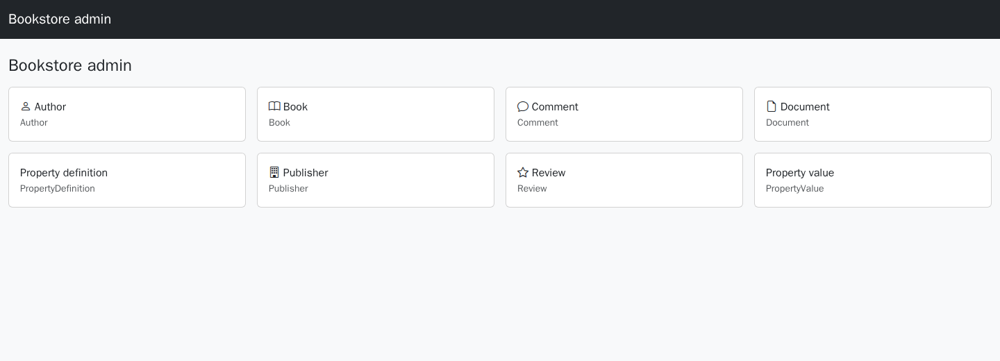
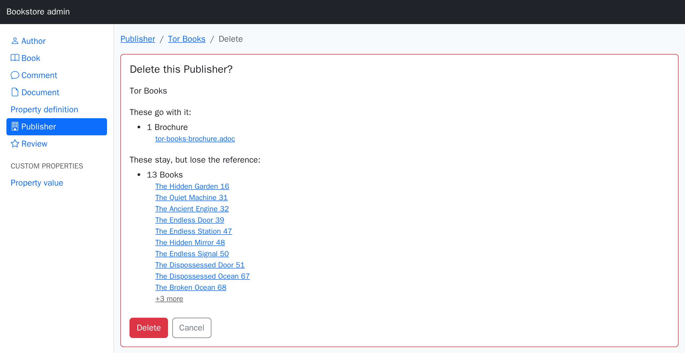

# The admin UI

A mountable backend over every model in your app: an index with the gem's usual filtering,
sorting and search, a record view, working forms, and a delete that tells you what it takes
with it.



## Setup

**1. Mount it.**

```ruby
# config/routes.rb
mount CrudComponents::Admin::Engine => '/admin'
```

**2. Say who may in** — in the ability, where the rest of your permissions live:

```ruby
class Ability
  include CanCan::Ability

  def initialize(user)
    can :crud_admin, :all if user&.admin?
  end
end
```

That is the whole gate. No initializer, no second place to look.

**3. Visit `/admin`.** Every model with a table is there.

## The gate

`:crud_admin` is one action that answers for the whole admin: the way in, which models the
sidebar offers, the scope each index renders, and every write. Inside the admin it stands in
for the finer action a request would otherwise be asked about, so `can :crud_admin, :all`
grants index, show, create, update and destroy on everything without listing them.

That makes the useful ability lines short:

```ruby
can :crud_admin, :all                       # a full admin
can :crud_admin, [Book, Author]             # a limited one: those two models, full CRUD
can :crud_admin, Book, publisher: user.publisher  # …and only their publisher's books
can :manage, :all                           # already grants it — `:manage` matches any action
```

Note the subject: `can :crud_admin` alone raises `CanCan::Error: Subject is required`.

Rules of your own still grant on their own, so a read-only admin is the ordinary CanCanCan
you would write anyway — as long as something grants `:crud_admin`, or nobody gets in:

```ruby
can :crud_admin, Book      # in, and full CRUD on books
can %i[index show], Author # …plus read-only access to authors
```

**Denied** requests go through your `authorize!`, so an app that rescues
`CanCan::AccessDenied` (a redirect to the login page, a flash) keeps doing that; without such
a handler the admin renders 403.

### Without CanCanCan

`auth_with` takes a gate of your own. The block runs as a `before_action` in the admin's
controller, so `current_user`, `redirect_to`, `head :forbidden` and your `rescue_from`s all
work as usual:

```ruby
# config/initializers/crud_components.rb
CrudComponents::Admin.configure do |config|
  config.auth_with { redirect_to main_app.root_path unless current_user&.admin? }
end
```

Anything else that answers `can?(action, subject)` works as the default gate does — the gem
depends on no authorization library. With neither (nothing answers `can?`, no block) every
request raises `CrudComponents::Admin::UnauthorizedError`, naming both ways out.

`config.auth_with :none` serves the admin with no gate at all — a public demo, a local
playground. `config.auth_with :cancan, action: :backend` renames the action asked about.

If your app already gates routes — a Devise `authenticate` block, a constraint — put the
mount inside it and keep the ability as the second lock.

## What each model gets

| Page | What it does |
| --- | --- |
| `/admin/books` | index: filter row, sortable headers, `?q=` search, column picker, pagination |
| `/admin/books/the-hobbit` | the record as a definition list, with edit / delete / *Show in app* |
| `/admin/books/new`, `…/edit` | forms, from the same fieldsets and permit list as `crud_form` |
| `/admin/books/the-hobbit/delete` | [what the delete takes with it](#deleting), then the delete |
| `/admin/publishers/tor-books/books` | one nested index per to-many association |

Everything a model declares in `crud_structure` — labels, icons, renderers, `if:`,
`editable:`, custom actions — applies here. A model that declares nothing gets the derived
default.

Indexes paginate when a pagination gem is loaded (kaminari, will_paginate); without one
they render every row.

## Choosing the models

By default: every model in `app/models` with a table. Framework tables (Active Storage,
Action Text, the job and cache backends), other gems' bookkeeping models, HABTM join models
and STI subclasses stay out.

**Drop or pick models in the initializer:**

```ruby
config.except = %w[Review]                    # everything but these
config.only   = %w[Book Publisher Author]     # exactly these, in this order
```

**Or decide it on the model**, in the `crud_structure` it already has:

```ruby
class Review < ApplicationRecord
  include CrudComponents::Model
  crud_structure { admin false }        # not in the admin at all
end
```

## Configuring a model

```ruby
crud_structure do
  admin group: 'Catalog', actions: %i[index show], label: 'Back catalogue'
end
```

| Option | What it does |
| --- | --- |
| `false` | keeps the model out entirely |
| `actions:` | which of `%i[index show new create edit update destroy]` exist. What you leave out has **no route** — a hand-crafted `POST` 404s |
| `group:` | the sidebar heading (defaults to the model's namespace, if any) |
| `label:` | the sidebar label (defaults to the model's human name — translate `activerecord.models.*` and it follows) |
| `fieldset:` | which fieldset the admin renders (default: `:admin` if you declare one, else every field) |
| `scope:` | narrows the base relation, e.g. `scope: -> { where(archived: false) }` |

**Read-only** is `actions: %i[index show]`.

**A different column set for the backend** than for your app: declare an `:admin` fieldset.
Without one the admin shows every field, which is usually what you want from a backend —
the column-picker gear narrows a wide table per view.

```ruby
fieldset :index, %i[cover title genre price]              # what the shop shows
fieldset :admin, %i[title genre price stock slug active]  # what an operator needs
```

## Who may do what

Beyond the gate, your existing permissions apply unchanged:

- **CanCanCan** (or anything answering `can?`): indexes go through `accessible_by`, and
  every action is authorized as the action it performs — `create` as `:create`, `destroy`
  as `:destroy`. A model you may not `:index` is not even listed in the sidebar.
- **`if:` and `editable:`** hide and freeze columns exactly as they do elsewhere, in the
  query layer too — see [Security](security.md).
- **Forms** permit exactly `CrudComponents.permitted_attributes`, the same list the form
  renders from.

### Hiding a column

The admin shows every column of a model, including the dull and the sensitive ones. To keep
one out, say so:

```ruby
attribute :api_key, if: false                        # nowhere, ever
attribute :internal_note, if: :manage                # only for those who may :manage
fieldset :admin, %i[name email created_at]           # not in the admin's list
```

Nothing is guessed from a column name — a `token` column that is safe to read stays
readable, and one that is not is your call to make.

## Deleting

The trash button opens a confirmation page rather than firing a `DELETE`:



It lists, from what the model declares:

- **what goes with it** — `dependent: :destroy` / `:destroy_async` / `:delete_all`, with
  counts, plus the record's attachments. Associations whose own targets cascade further are
  marked as such; the count is the first level;
- **what stays but loses the reference** — `dependent: :nullify`;
- **what blocks it** — `:restrict_with_error` / `:restrict_with_exception` with rows still
  attached. The Delete button stays disabled while any of those hold.

Ticking rows in the index and using **Delete selected** skips the page (a hundred rows have
no legible blast radius) but still checks each record against the ability on its own.

## Between the admin and your app

**Show in app** sits on every record and every row, and links to the page a visitor would
see — when there is one. It resolves the conventional route against your application. When
your URL is not conventional, say so:

```ruby
crud_structure do
  app_path { |book| main_app.publisher_book_path(book.publisher, book) }
end
```

Return `nil` for a record to leave the button off. The helper is public, so an ordinary page
can use it too: `crud_app_path(record)`.

**The other direction** — from an app page into the admin:

```erb
<% if (url = crud_admin_path(@book, :edit)) %>
  <%= link_to 'Edit in admin', url %>
<% end %>
```

`crud_admin_path(record, action = :show)` — also `:index`, `:new` — finds the mount point
itself and returns `nil` when the admin isn't mounted, the model isn't registered, or that
action isn't enabled for it.

## Making it fit your app

**Its own shell** (the default) is a plain Bootstrap 5 page with the model sidebar. It loads
Bootstrap and Bootstrap Icons from a CDN; to load a build of your own instead, override the
layout — `app/views/layouts/crud_components/admin.html.erb` in your app wins over the
bundled one, the same override rule as every other view here.

**Your layout** instead:

```ruby
config.layout = 'application'
```

Two things to know when you do: render the sidebar yourself if you want it
(`render 'crud_components/admin/sidebar'`), and **route helpers in that layout must go
through `main_app`** — the admin renders inside an engine, so a bare `root_path` there
resolves against the engine's routes and raises. `main_app.root_path` is safe everywhere.

**Individual pages and partials**: everything the admin renders is a partial under
`app/views/crud_components/admin/`, and a file at the same path in your app wins — the same
override rule as the rest of the gem ([Extending](extending.md)).

## Configuration reference

```ruby
CrudComponents::Admin.configure do |config|
  config.auth_with :cancan               # the default: `can :crud_admin, :all` in the ability
  config.auth_with :cancan, action: :backend  # …asking about another action
  config.auth_with { head :forbidden unless current_user&.admin? }  # a gate of your own
  config.auth_with :none                 # no gate at all — a demo, a local playground

  config.title  = 'Bookstore admin'        # brand line
  config.layout = 'crud_components/admin'  # the bundled shell, or one of yours

  config.only   = nil                    # Array of model names, or nil for all
  config.except = []                     # Array of model names (or the classes)
  config.groups = ['Catalog', 'People']  # sidebar group order; the rest follow alphabetically
  config.excluded_namespaces << 'Legacy' # more model-name prefixes to skip

  config.counts   = true                 # record counts on the dashboard
  config.per_page = 50                   # rows per index page
  config.parent_controller = '::ApplicationController'  # what the admin's controllers inherit
end
```

`parent_controller` is how the admin reaches your `current_user`, your session and your
`rescue_from`s.

## Worth knowing

- **A new model needs a restart.** Routes are generated per model at boot.
- **Wide tables scroll.** A model with 40 columns gets 40 columns; declare an `:admin`
  fieldset or use the column-picker gear.
- **A host helper wins over a route helper of the same name.** If your app defines
  `ApplicationHelper#map_path`, the admin's label cells use it and link to *your* page;
  `Edit` and the rest still point into the admin.
- **A missing table** (a half-migrated database) leaves that model out of the sidebar
  rather than taking the admin down.
