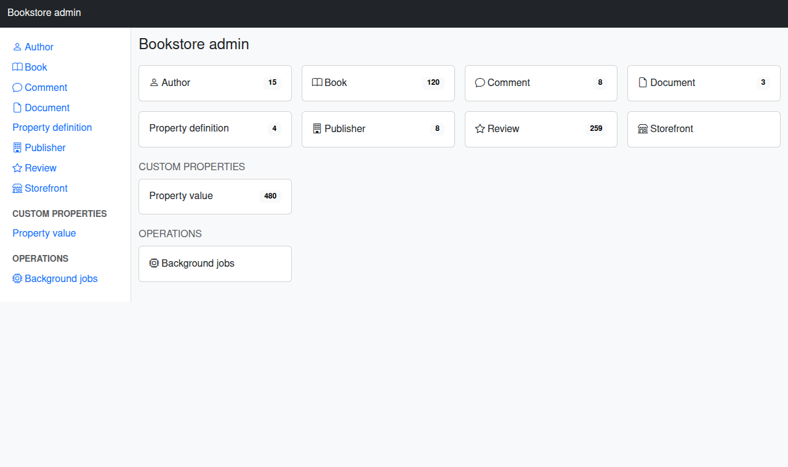
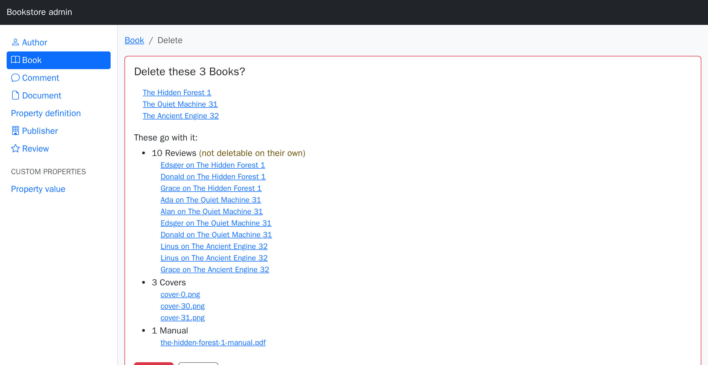

# The admin UI

A mountable backend over every model in your app: an index with the gem's usual filtering,
sorting and search, a record view, working forms, and a delete that tells you what it takes
with it.


## Setup

**1. Mount it.**

```ruby
# config/routes.rb
mount CrudComponents::Admin::Engine => '/admin'
```

**2. Say who may in** — in the ability, where the rest of your permissions live:

```ruby
class Ability
  include CanCan::Ability

  def initialize(user)
    can :access, :crud_admin if user&.admin?
  end
end
```

That is the whole gate. No initializer, no second place to look.

**3. Visit `/admin`.** Every model with a table is there.

## The gate

`can :access, :crud_admin` decides one thing: whether this visitor may open the admin at
all. `:crud_admin` is not a model — it is a plain symbol standing for the backend itself.

**Past the door, nothing changes.** Your ability keeps deciding, model by model and action
by action, exactly as it does on your own pages: a model you may not `:index` is not in the
sidebar and its URL is refused, indexes go through `accessible_by`, each write is authorized
as the action it performs, and `if:`/`editable:` still hide and freeze columns. The gate
grants entry, not permission.

```ruby
class Ability
  include CanCan::Ability

  def initialize(user)
    return unless user

    can :access, :crud_admin if user.staff?      # may open the admin
    can :manage, Book                            # …and inside it, may do everything with books
    can %i[index show], Author                   # …and only look at authors
    # no rule for Review → no Review in the sidebar, /admin/reviews refused
  end
end
```

So an operator who may open the admin but has no rule for a model sees an admin without it.
That is the point: one ability, one answer, wherever it is asked.

**Denied** requests go through your `authorize!`, so an app that rescues
`CanCan::AccessDenied` (a redirect to the login page, a flash) keeps doing that; without such
a handler the admin renders 403.

### Without CanCanCan

`auth_with` takes a gate of your own. The block runs as a `before_action` in the admin's
controller, so `current_user`, `redirect_to`, `head :forbidden` and your `rescue_from`s all
work as usual:

```ruby
# config/initializers/crud_components.rb
CrudComponents::Admin.configure do |config|
  config.auth_with { redirect_to main_app.root_path unless current_user&.admin? }
end
```

Anything else that answers `can?(action, subject)` works as the default gate does — the gem
depends on no authorization library. With neither (nothing answers `can?`, no block) every
request raises `CrudComponents::Admin::UnauthorizedError`, naming both ways out.

`config.auth_with :none` serves the admin with no gate at all — a public demo, a local
playground. `config.auth_with :cancan, subject: :backend` asks about a symbol of your own,
for an app that already has one (`can :access, :backend`).

If your app already gates routes — a Devise `authenticate` block, a constraint — put the
mount inside it and keep the ability as the second lock.

## What each model gets

| Page | What it does |
| --- | --- |
| `/admin/books` | index: filter row, sortable headers, `?q=` search, column picker, pagination |
| `/admin/books/the-hobbit` | the record as a definition list, with edit / delete / *Show in app* |
| `/admin/books/new`, `…/edit` | forms, from the same fieldsets and permit list as `crud_form` |
| `/admin/books/the-hobbit/delete` | [what the delete takes with it](#deleting), then the delete |
| `/admin/publishers/tor-books/books` | one nested index per to-many association |

Everything a model declares in `crud_structure` — labels, icons, renderers, `if:`,
`editable:`, custom actions — applies here. A model that declares nothing gets the derived
default.

Indexes paginate when a pagination gem is loaded (kaminari, will_paginate); without one
they render every row.

## Choosing the models

By default: every model in `app/models` with a table. Framework tables (Active Storage,
Action Text, the job and cache backends), other gems' bookkeeping models, HABTM join models
and STI subclasses stay out.

**Leave a model out on the model itself**, in the `crud_structure` it already has:

```ruby
class Review < ApplicationRecord
  include CrudComponents::Model
  crud_structure { admin false }        # not in the admin at all
end
```

The initializer has global switches for the cases a model cannot answer for itself — a model
from another gem, or an allow-list for a small admin:

```ruby
config.except = %w[Review]                    # everything but these
config.only   = %w[Book Publisher Author]     # exactly these, in this order
```

Prefer `admin false` where you own the model: the decision then sits next to the model it is
about, and a renamed or deleted model cannot leave a stale name behind in the initializer.

## Per model

Everything the admin shows about one model is declared on that model, in its
`crud_structure`:

```ruby
class Publisher < ApplicationRecord
  include CrudComponents::Model

  crud_structure do
    icon 'building'                                  # sidebar, dashboard card, index heading
    admin group: 'Catalog', label: 'Imprints', actions: %i[index show]
  end
end

class Review < ApplicationRecord
  include CrudComponents::Model
  crud_structure { admin false }                     # not in the admin at all
end
```

| Declaration | What it does |
| --- | --- |
| `icon 'building'` | the model's icon — in the sidebar, on its dashboard card and in its index heading, and outside the admin wherever the model is badged ([Fields](fields.md#identity-label-identify_by-search_in-icon)) |
| `admin false` | keeps the model out entirely |
| `admin actions:` | which of `%i[index show new create edit update destroy]` exist. What you leave out has **no route** — a hand-crafted `POST` 404s |
| `admin group:` | the sidebar heading (defaults to the model's namespace, if any) — [translatable](#translating-the-group-headings) |
| `admin label:` | the sidebar label (defaults to the model's human name — translate `activerecord.models.*` and it follows) |
| `admin fieldset:` | which fieldset the admin renders (default: `:admin` if you declare one, else every field) |
| `admin scope:` | narrows the base relation, e.g. `scope: -> { where(archived: false) }` |

**Read-only** is `admin actions: %i[index show]`.

**The initializer only fills gaps.** `config.model_icons` is the name-based guess for a model
that declares no `icon` (`Publisher → building` ships with the gem), and
`config.model_fallback_icon` badges whatever is still left; a declared `icon` always wins.
`config.except` and `config.only` are global switches next to `admin false`. What belongs
in the initializer is what no single model can say: the [group order](#translating-the-group-headings)
(`config.groups`), the title, the layout, the parent controller.

### Translating the group headings

The declared name is the default, not the last word. Each heading is looked up under its own
key — the declared name parameterized, so `group: 'Custom properties'` reads
`crud_components.admin.groups.custom_properties`:

```yaml
de:
  crud_components:
    admin:
      groups:
        custom_properties: "Eigene Felder"
```

`config.groups` orders by the **declared** name, so the order holds in every locale:
`config.groups = ['Custom properties']` still puts that group first when its heading reads
"Eigene Felder". Groups it does not name follow, alphabetically by heading.

**A different column set for the backend** than for your app: declare an `:admin` fieldset.
Without one the admin shows every field, which is usually what you want from a backend —
the column-picker gear narrows a wide table per view.

```ruby
fieldset :index, %i[cover title genre price]              # what the shop shows
fieldset :admin, %i[title genre price stock slug active]  # what an operator needs
```

## Links of your own

The sidebar and the dashboard list the models, and can list any other page you want an
operator to find next to them: a mounted jobs dashboard, a report, a page of your own app.

```ruby
CrudComponents::Admin.configure do |config|
  config.link 'Background jobs', path: -> { main_app.jobs_dashboard_path },
                                 group: 'Operations', icon: 'cpu',
                                 if: -> { can?(:manage, :jobs) }
  config.link :storefront, path: -> { main_app.root_path }, icon: 'shop'
end
```



| Option | |
| --- | --- |
| label | a String as is, or a Symbol looked up under `crud_components.admin.links.<label>` (default: humanized) |
| `path:` | a String, or a block run in the admin's view, where `main_app.…_path` and a mounted engine's route helpers are in reach. A block returning nil, or naming a `…_path` helper the app does not have, leaves the link out |
| `group:` | the sidebar group, as for a model: the link joins a model group of the same name (after its models), [translates](#translating-the-group-headings) the same way, and `config.groups` orders it |
| `icon:` | an icon name without the library prefix, as for a model |
| `if:` | a block run in the admin's view; a falsy result leaves the link out. `can?` is there when your ability is a view helper, as CanCanCan's is |

`if:` only decides whether the link is shown. The page behind it still has to check access
on its own: a mounted dashboard has its own authentication, and the admin's gate does
not cover it.

## Who may do what

Beyond the gate, your existing permissions apply unchanged:

- **CanCanCan** (or anything answering `can?`): indexes go through `accessible_by`, and
  every action is authorized as the action it performs — `create` as `:create`, `destroy`
  as `:destroy`. A model you may not `:index` is not even listed in the sidebar.
- **`if:` and `editable:`** hide and freeze columns exactly as they do elsewhere, in the
  query layer too — see [Security](security.md).
- **Buttons follow the ability**: no `:destroy` on a record, no delete button on its row; none
  on the model, no **Delete selected** in the toolbar. What is refused is not offered.
- **Forms** permit exactly `CrudComponents.permitted_attributes`, the same list the form
  renders from.

### Hiding a column

The admin shows every column of a model, including the dull and the sensitive ones. To keep
one out, say so:

```ruby
attribute :api_key, if: false                        # nowhere, ever
attribute :internal_note, if: :manage                # only for those who may :manage
fieldset :admin, %i[name email created_at]           # not in the admin's list
```

Nothing is guessed from a column name — a `token` column that is safe to read stays
readable, and one that is not is your call to make.

## Deleting

The trash button opens a confirmation page rather than firing a `DELETE`:


It lists, from what the model declares:

- **what goes with it** — `dependent: :destroy` / `:destroy_async` / `:delete_all`, with
  counts, plus the record's attachments. Associations whose own targets cascade further are
  marked as such; the count is the first level. A collection is counted in SQL, a
  `has_one` / `belongs_to` is one record or none, even when its target has a `count`
  column of its own (a book's `stock`, say);
- **what stays but loses the reference** — `dependent: :nullify`;
- **what blocks it** — `:restrict_with_error` / `:restrict_with_exception` with rows still
  attached. The Delete button stays disabled while any of those hold.

Each group **names its records**, not just their number: the first ten, each linking to its
own admin page, and past that a link to the index holding the rest — the nested index under
the record (`/admin/publishers/tor-books/books`), else that model's index filtered by it. An
attachment names its file and links to it, opened in a new tab. A count tells you how much
goes; the names tell you what.

A cascade can reach further than you: `dependent: :destroy` takes records the ability would
not let you delete one by one. That is not blocked — the database does it either way — but the
group is **marked** on the page, so the delete is a decision rather than a surprise.

Ticking rows in the index and using **Delete selected** reaches **the same page**, for the
whole selection (`/admin/books/delete` rather than `/admin/books/hobbit/delete`): one record
is a selection of one. The ticked records are named, and what goes with them is counted
across all of them at once. Each record is still checked against the ability on its own —
what the ability withholds is neither listed nor deleted.



## Between the admin and your app

**Show in app** sits on every record and every row, and links to the page a visitor would
see — when there is one. It resolves the conventional route against your application. When
your URL is not conventional, say so:

```ruby
crud_structure do
  app_path { |book| main_app.publisher_book_path(book.publisher, book) }
end
```

Return `nil` for a record to leave the button off. The helper is public, so an ordinary page
can use it too: `crud_app_path(record)`.

**The other direction** — from an app page into the admin:

```erb
<% if (url = crud_admin_path(@book, :edit)) %>
  <%= link_to 'Edit in admin', url %>
<% end %>
```

`crud_admin_path(record, action = :show)` — also `:index`, `:new` — finds the mount point
itself and returns `nil` when the admin isn't mounted, the model isn't registered, or that
action isn't enabled for it.

## Making it fit your app

**Its own shell** (the default) is a plain Bootstrap 5 page with the model sidebar. It loads
Bootstrap and Bootstrap Icons from a CDN; to load a build of your own instead, override the
layout — `app/views/layouts/crud_components/admin.html.erb` in your app wins over the
bundled one, the same override rule as every other view here.

**Your layout** instead:

```ruby
config.layout = 'application'
```

Two things to know when you do: render the sidebar yourself if you want it
(`render 'crud_components/admin/sidebar'`), and **route helpers in that layout must go
through `main_app`** — the admin renders inside an engine, so a bare `root_path` there
resolves against the engine's routes and raises. `main_app.root_path` is safe everywhere.

**Individual pages and partials**: everything the admin renders is a partial under
`app/views/crud_components/admin/`, and a file at the same path in your app wins — the same
override rule as the rest of the gem ([Extending](extending.md)).

## Configuration reference

```ruby
CrudComponents::Admin.configure do |config|
  config.auth_with :cancan               # the default: `can :access, :crud_admin` in the ability
  config.auth_with :cancan, subject: :backend # …asking about a symbol of your own
  config.auth_with { head :forbidden unless current_user&.admin? }  # a gate of your own
  config.auth_with :none                 # no gate at all — a demo, a local playground

  config.title  = 'Bookstore admin'        # brand line
  config.layout = 'crud_components/admin'  # the bundled shell, or one of yours

  config.only   = nil                    # Array of model names, or nil for all
  config.except = []                     # Array of model names (or the classes); per model: `admin false`
  config.groups = ['Catalog', 'People']  # group order, by declared name; the rest follow alphabetically
  config.excluded_namespaces << 'Legacy' # more model-name prefixes to skip

  config.counts   = true                 # record counts on the dashboard
  config.link 'Background jobs', path: -> { main_app.jobs_dashboard_path },
              group: 'Operations', icon: 'cpu', if: -> { can?(:manage, :jobs) }  # a page of your own
  config.per_page = 50                   # rows per index page
  config.parent_controller = '::ApplicationController'  # what the admin's controllers inherit
end
```

`parent_controller` is how the admin reaches your `current_user`, your session and your
`rescue_from`s.

## Worth knowing

- **A new model needs a restart.** Routes are generated per model at boot.
- **Wide tables scroll.** A model with 40 columns gets 40 columns; declare an `:admin`
  fieldset or use the column-picker gear.
- **A host helper wins over a route helper of the same name.** If your app defines
  `ApplicationHelper#map_path`, the admin's label cells use it and link to *your* page;
  `Edit` and the rest still point into the admin.
- **A missing table** (a half-migrated database) leaves that model out of the sidebar
  rather than taking the admin down.
