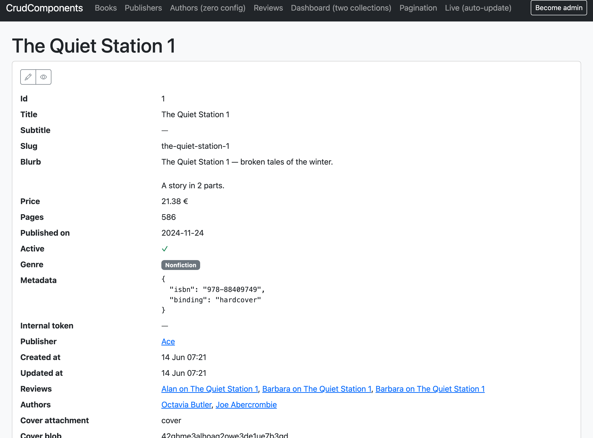
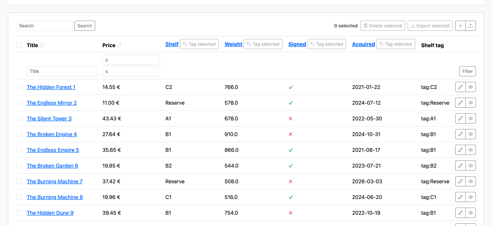

# Fields & rendering

Everything in a `crud_structure` is, ultimately, about fields: what they are, how they
render, how they filter and sort. This is the reference for that. For the one-page
summary read the [combination table](../README.md#the-combination-table) in the README
first; this doc is the per-flavor depth behind it.

Running example: the bookstore from the [README](../README.md#the-running-example).

## You rarely declare fields


All columns, enums and associations are already fields — derived from what Rails knows.
Declare an `attribute` only to *improve* one:

```ruby
attribute :price, as: :number, unit: '€', digits: 2   # renderer + options
attribute :internal_notes, if: :manage                # column-level permission
attribute :token, filter: false                       # opt a derived field out of filtering
```

`if:` gates a column's visibility on a `can?` symbol or a lambda — hidden everywhere
(table, record, forms, `?q=`) for users who fail the check. See
[permissions](security.md#permissions).

`attributes` (plural) applies shared options to several fields at once:

```ruby
attributes :participants, :owner, if: :manage
```

The field universe is always *all* derived columns/associations plus declared computed
fields. `attribute` never adds or removes a column from a table — that is exclusively
the job of [fieldsets](views.md#fieldsets).

## Renderers



Every field has a derived renderer. Name one explicitly with `as:` to override it, and
pass renderer options inline:

```ruby
attribute :price,  as: :number, unit: '€', digits: 2
attribute :blurb,  as: :markdown
attribute :rating, as: :stars       # a custom renderer, see Extending
```

`as:` is the field's renderer ("present this as a …"), reading like simple_form's
`f.input :price, as: :string`. (It's distinct from `crud_collection`'s `layout:`, which
picks the whole-collection arrangement — field renderer vs. component layout.)

For one-off markup, a block that takes the record renders the cell inline — no named
renderer needed:

```ruby
attribute(:badge) { |record| tag.span(record.status, class: 'badge') }
```

The block is the inline custom-markup form; the `render` facet (below) is the same thing
inside a facet block. See [Custom markup](#custom-markup) for how blocks run.

Built-in renderers:

* `:text` — truncates in a collection, keeps line breaks on a record page.
* `:number` — `unit:` (suffix) and `digits:` (decimal places).
* `:date` — localized.
* `:datetime` — localized.
* `:boolean` — ✓/✗ icon; nil shows `—`.
* `:enum` — i18n'd badge; nil shows `—`.
* `:association` — nil-safe link via the target's `label`.
* `:association_list` — "a, b +n more" links.
* `:attachment` — supports `has_one_attached` / `has_many_attached`: each file is drawn by content type — an image inline, a previewable file (e.g. PDF) as a preview, anything else as an icon + filename download link. Sized by surface; a has_many set renders as a row.
* `:json` — pretty-printed `<pre>`, syntax-highlighted when [rouge](https://github.com/rouge-ruby/rouge) is present (optional — no rouge, no colors, no error).
* `:markdown` — needs one of [commonmarker](https://github.com/gjtorikian/commonmarker), [redcarpet](https://github.com/vmg/redcarpet) or [kramdown](https://github.com/gettalong/kramdown) in your bundle; **raises at boot** if none is present.
* `:asciidoc` — needs [asciidoctor](https://github.com/asciidoctor/asciidoctor); **raises at boot** if absent.
* `:email` — a `mailto:` link.
* `:url` — an http(s) value as a link (a non-URL stays plain text).

**Smart links by name.** A string column named `email` (or `*_email`) renders as `:email`,
and one named `url`, `website`, `link` or `homepage` renders as `:url`, with no
configuration. The trigger is the *column name*, never the value — a `description` that
happens to contain a URL is left alone — so it stays predictable and safe. `as:` overrides
either way. [Path columns](#path-columns) apply the same rule to their target name, so
`authors.email` shows a list of `mailto:` links.

**Renderers are surface-aware.** Each receives `surface:` (`:collection` or `:record`)
and adapts: `:text` truncates in a collection but keeps line breaks on a record,
`:attachment` shrinks to a thumbnail in table cells, `:json` truncates its `<pre>` in
collections.

To add your own renderer, see [Extending](extending.md#add-a-field-renderer).

## Computed fields

A name that is not a column, enum or association falls back to a **public model
method**, rendered by its value type — no ceremony:

```ruby
def shop_margin = price - purchase_price
# `shop_margin` is already a usable, display-only field
```

A name that is *nothing* (no column/enum/association/method) and has no `render` facet
raises at boot, telling you to add one.

### Custom markup

For custom HTML, a block that takes the record is the shortest form:

```ruby
attribute(:cover) { |book| image_tag book.cover.variant(:large), class: 'rounded' }
```

Blocks are **stored** in the model but **executed in the view context at render time** —
which is why `image_tag`, `link_to`, route helpers, `t` and your app's own helpers all
work inside them even though the block lives in a model file.

> **The view-context rule.** Presentation blocks (`render`, `label`, action path
> blocks) are `instance_exec`'d in the view with the record as the sole argument. Inside
> such a block `self` is the view — so call model methods *on the record argument*, not
> on `self`. Local variables captured by the closure are available; instance variables
> of the surrounding class body are not.

Customizing how a field renders costs nothing else: a string column with a custom
`render` block **keeps** its derived filter and sort. Overrides are per facet.

## Facets

When a field needs more than rendering, its facets live together in one block:

```ruby
attribute :author_names do
  render { |book| book.authors.map(&:name).to_sentence }
  filter authors: :name
  sort   { |scope, dir| scope.left_joins(:authors).order('authors.name' => dir) }
end
```

| Facet                                           | Takes                         | Effect                                                                                     |
| ----------------------------------------------- | ----------------------------- | ------------------------------------------------------------------------------------------ |
| `render { \|record\| … }`                       | a block (markup)              | overrides the rendered cell. Named renderers are `as:`'s job; this facet is block-only     |
| `filter spec` / `filter { \|scope, value\| … }` | a positional spec or block    | overrides/adds the filter. `filter false` switches a derived filter off                    |
| `sort :column` / `sort { \|scope, dir\| … }`    | an own-column symbol or block | overrides/adds the sort (`dir` is guaranteed `:asc`/`:desc`). `sort false` switches it off |

Why filter/sort are opt-in for computed fields: **filtering and sorting run in SQL**, so
they stay correct on large tables and under pagination. A Ruby-computed value has no SQL
meaning until a facet tells the gem how to express it.

> **Query-block contract.** `filter`/`sort`/`search_in` blocks receive `(scope, value)`
> (or `(scope, dir)` for sort) and return a relation. There is no view context at query
> time; the scope arrives extended with `where_like` (below).

## Dynamic columns

Some columns aren't part of the model at all — user-defined properties kept in a
separate store (a definitions + values pair, a JSONB blob, a remote API). They are
per-account, per-request data, so they don't belong in the model's `crud_structure`
(which is built once per class and shared by every request). Instead you build a
`CrudComponents::DynamicColumn` per request and pass the set to `crud_collection` via
`extra_columns:` — the model stays untouched, the column rides alongside the declared
ones:

```ruby
# however your custom properties are stored, you adapt them to columns:
columns = current_account.custom_properties.map do |prop|
  CrudComponents::DynamicColumn.new(
    prop.key,                                  # the column name (→ ?sort=, ?cols=)
    label: prop.label, as: prop.renderer,      # any built-in renderer: :number, :date, …
    if:      -> { can?(:read, prop) },         # same gate as a field's if:
    preload: ->(records) {                     # one batch-load per page — no N+1
      PropertyValue.where(definition: prop, subject: records).index_by(&:subject_id)
    }
  ) { |record, loaded| loaded[record.id]&.value }  # the value resolver
end

crud_collection @books, extra_columns: columns
```

The block is the **value resolver**: `|record|` or `|record, loaded|`, where `loaded`
is whatever `preload:` returned. It returns a plain value that the `as:` renderer (or,
with no `as:`, the value's type, exactly like a [computed field](#computed-fields))
displays. `preload:` runs once over the page's rows so a whole table costs one fetch,
not one per row.

A dynamic column is **display-only** until you give it the query facets — the same
`filter:`/`sort:` blocks the DSL takes, supplied as keyword arguments. Give them only
when the data is reachable in SQL; without them the column never reaches the query
layer, which keeps the [whitelist](security.md) tight:

```ruby
CrudComponents::DynamicColumn.new(:priority, as: :number,
  preload: ->(records) { … },
  filter:  ->(scope, value) {
    # `where_like` escapes the user's %/_ and builds the ILIKE for you — never
    # hand-write `where("value LIKE ?", "%#{value}%")`. The block's own `scope`
    # already carries `#where_like`; for a subquery on another model use the
    # module function on that relation:
    matches = CrudComponents.where_like(PropertyValue.where(definition: prop), :value, value)
    scope.where(id: matches.select(:subject_id))
  },
  sort:    ->(scope, dir)   { scope.order(Arel.sql("(#{subquery_for(prop)}) #{dir}")) }
) { |record, loaded| loaded[record.id]&.value }
```

`if:` follows the same rules as a declared field's: a denied column is absent from the
table, the filter row, sorting and `?cols=` — everywhere. See the column picker in
[views.md](views.md#column-picker) for letting users choose which of these they see, and
the `/custom_fields` page in `test/dummy` for a full worked example (string, number,
boolean and date flavors, all filtering and sorting).

`crud_record` takes `extra_columns:` too, so the same user-defined properties show as extra
rows on a detail view — batch-loaded on the single record.

### Custom headers and column actions

A dynamic column often *is* a domain object — a mail, a resource, a property — so its
header naturally wants a **link** to that object and its own **bulk actions** ("Send to
selected", "Activate for all"). Two keyword arguments put those right in the `<th>`:



```ruby
CrudComponents::DynamicColumn.new(:mail_42,
  label:  'Welcome mail',
  header: -> { link_to mail.name, mail },              # an HTML-safe String, or a view-context block
  header_actions: [                                    # the same Action API as row/collection actions
    CrudComponents::Action.new(:send_selected, on: :selection, icon: 'send', method: :post) { send_path(mail) },
    CrudComponents::Action.new(:send_all,       on: :collection, icon: 'send-fill', method: :post) { send_all_path(mail) }
  ],
  preload: ->(records) { … }) { |record, loaded| loaded[record.id] }
```

* **`header:`** replaces the column's plain `human_name` in the header. A **String** is
  rendered as-is — mark it `html_safe` if it carries markup. A **block** is `instance_exec`ed
  in the view, so it may call `link_to` and any URL helper. When you set a header the column's
  sort link is dropped (a column with its own header is usually display-only anyway); omit
  `header:` to keep the default `human_name` + sort behavior. With `header_actions:` but no
  `header:`, the normal title (sortable link or plain name) is kept and the actions appended.
* **`header_actions:`** is a list of plain `CrudComponents::Action`s, rendered in the header
  with the same icons/titles/`confirm:` as everywhere else. Each action's path block closes
  over the column's object (`mail` above). The action's **`on:`** decides how it acts and renders:
  * **`on: :selection`** — acts on the **ticked rows** × this column's object. It submits the
    same shared select-form the toolbar's bulk actions use, so the checked `selected[]` slugs
    ride along to your endpoint. Declaring one **makes the collection selectable** (the checkbox
    column appears) automatically — no extra wiring. Resolve them server-side with
    `CrudComponents.selected(scope, params)`, exactly like a toolbar selection action.
  * **`on: :collection`** (or `:row`) — a plain, selection-independent link/button (a non-GET
    method renders as a CSRF-safe `button_to` form). Use it for "do this for *all* rows of this
    column", where the selection is irrelevant.

Permissions here can only **show or hide** a header action (via `if:` — which also closes over
`mail`, e.g. `if: -> { can?(:send, mail) }`); *which* rows a `:selection` action ultimately
touches is chosen in the browser, so enforce per-record authorization in your controller when
the request arrives.

These are not specific to `DynamicColumn` — a declared `attribute :status, header_actions: […]`
takes the same options. Everything works in the non-grouped and grouped (`group_by:`) layouts,
and plays with the column picker (a hidden column simply renders no header). The
`/column_headers` page in `test/dummy` is a full worked example. This is what lets a
participants × mails / × resources **matrix** live entirely in `crud_collection` — one
`DynamicColumn` per mail/resource, its controls in its own header — instead of a hand-built
controls strip above the table.

## Path columns

A field name with a **dot** reaches through associations: `publisher.name`,
`publisher.founded_on`, `authors.email`. The leading segments are associations on the
model; the last is an attribute (or method) on the target. Use them anywhere a field name
goes — a fieldset, `visible:`, `?cols=` — so they show up in the [column picker](views.md#column-picker)
like any other column. No block needed; it's the declarative shortcut for what you'd
otherwise write as a computed field with a `render` + `filter` + `sort`:

```ruby
fieldset :index, %i[title publisher.name authors.email]
```

- A **single-valued** path (belongs_to / has_one) **delegates to the target model's own
  field** for that attribute — `publisher.founded_on` renders, filters and sorts exactly
  like Publisher's `founded_on` does: a date cell, a **date-range** filter, an ORDER BY the
  date. `publisher.price` keeps the target's `unit:`/`digits:`; a `publisher.status` enum gets
  the target's **select** filter and humanized badge. The path needn't repeat any of it —
  declare it once on the target model, reuse it through every association.
- When the leaf attribute **is the target's label field** (`publisher.name`), the cell renders
  a **link to that record** — the model's [icon](#identity-label-identify_by-search_in-icon)
  then a link to its show page — so a path column doubles as a jump-to-the-object.
- A **list** path (has_many / habtm) renders the values joined — `authors.email` shows
  every author's email (each linkified, since `email` is a smart-rendered name) — and is
  **filterable** (a contains-match through the join, via the [search spec](#the-search-spec))
  but not sortable by default (no single value to order by; add a `sort` facet if you have a
  meaningful aggregate).

The association is eager-loaded automatically, so a path column costs one query per page,
not one per row.

**Override > target field > default.** Anything the path inherits from the target field can
be overridden on the path column itself — `as:` (or a `render`/`filter`/`sort` facet) wins,
then the target field's behaviour, then the inferred default. So
`attribute(:"publisher.price", unit: '$')` re-bases just the unit; `attribute(:"publisher.name", as: :string)` opts the label column out of the link.

**Two limits.** The chain may be at most `config.max_path_depth` associations deep (default
3 — a guard rail against runaway joins; raise it if you need deeper). And it may cross **at
most one to-many** association: chain belongs_to/has_one freely, but a second has_many/habtm
would fan the list out into a meaningless list-of-lists. So `authors.publisher.name`
(habtm → one) is fine; `authors.books.title` (habtm → many) raises at resolve time. Both
limits report a clear `DefinitionError`.

`if:`, `label:` and facet overrides work as on any field — declare the path with
`attribute(:"authors.email", if: :manage)` to gate it, or give it a block to override how it
renders, filters or sorts.

## The search spec

One declarative mini-language for "case-insensitive contains across these columns,
joining as needed" — shared by `filter` (passed positionally) and `search_in`:

```ruby
filter :title                                  # own column
filter :title, :subtitle                       # several own columns, OR-combined
filter authors: %i[name email]                 # join, explicit columns
filter user: { address: %i[street town] }      # nested joins, explicit columns
filter :publisher                              # join, DELEGATE to Publisher's search_in
filter :title, { authors: :name }              # mixed
```

The **delegation form** — an association name *without* columns — means "search it the
way that model defines being searched" (its `search_in`). It is the idiomatic style and
stays correct as the target model's definition evolves.

The gem turns a spec into `left_joins` plus parameterized, wildcard-escaped `ILIKE`
(via `sanitize_sql_like` with an explicit `\` escape char, so `%`, `_` and `\` are all
literal). A spec contains only column/association names you wrote — **no SQL strings**,
nothing to sanitize. A joined match is `DISTINCT`; an own-column spec is not (no join to
dedupe). Delegation cycles are guarded (max 5 delegation hops) and raise rather than
stack-overflow.

### The escape hatch

A block is the escape hatch for genuinely custom logic; the scope it receives carries
the same machinery, so you keep the safe pit of success without `sanitize_sql_like`:

```ruby
filter do |scope, value|
  scope.where(active: true).where_like({ authors: :name }, value)
end
```

`where_like(spec, value)` is available on every scope handed to a filter/search block.
Raw SQL in a block is possible — and then explicitly your responsibility.

## Identity: `label`, `identify_by`, `search_in`, `icon`

```ruby
label :title              # method or block; default: name → title → first string column → "Book #42"
identify_by :slug         # default: :id
search_in :title, :subtitle, :publisher   # default: own string/text columns
icon 'book'               # default: guessed from the model name (config.model_icons), else none
```

- **`label`** — the record's display name: links, select options, record headings.
  Block form: `label { |book| "#{book.title} (#{book.published_on&.year})" }`. With no
  string column at all it falls back to `"Book #42"` (`model_name.human` + ` #` + id).
  When the label reaches into associations, declare them with `preload:` so they're
  eager-loaded wherever this model is shown — `label :full_title, preload: %i[publisher]`
  ([Performance](performance.md#eager-loading-render-dependencies)).
- **`identify_by`** — the column URL params use to identify a record of this model. With
  `identify_by :slug`, a filter URL reads `?publisher=tor-books` and resolves via
  `Publisher.where(slug: …)`.
- **`search_in`** — the model's text identity: what `?q=` searches, what the belongs_to
  text-filter fallback matches, and what delegated specs (`filter :publisher`) expand to.
- **`icon`** — a Bootstrap-icon name (no `bi-` prefix — paired with `config.css.icon_prefix`,
  swap the whole library there) that badges the model wherever it appears: column-picker
  groups, association links, path-column cells. Undeclared, it's guessed from the model name
  via `config.model_icons` (`User → person`, `Publisher → building`, …); an unmapped model
  with no declaration shows no icon (set `config.model_fallback_icon` to badge every model).
  Reach it in your own views with `crud_model_icon(record_or_class)` (the `<i>` tag) or
  `crud_model_icon_name(…)` (just the name).

### Identity composes through associations

These three are not just for the model's own pages — they define how **other** models
render, link and filter it through their associations:

```ruby
class Publisher < ApplicationRecord
  include CrudComponents::Model
  crud_structure do
    label :name
    identify_by :slug
    search_in :name
  end
end
```

Every model with a `belongs_to :publisher` now gets, for free: a column rendering the
publisher's name as a link (or a muted placeholder when nil), a filter valued by slug,
and — wherever a spec says `:publisher` — text search through the publisher's
name. Declared once, where Publisher lives; correct everywhere it appears. This is the
gem's central idea: per-model declarations composed over the association graph.

### Re-titling an association column

A `belongs_to`/`has_many` column links the associated record using the
**target's** `label`. To title it differently *for this column* — keeping the same
nil-safe link and route resolution — pass a `label:` callable that receives the record.
For example, a `Review`'s `book` column, re-titled to include the publisher:

```ruby
attribute :book, label: ->(book) { "#{book.title} (#{book.publisher.name})" }
```

The same `Book` reads as just `The Hobbit` on its own pages and in most columns, but here
it shows `The Hobbit (Tor Books)` — without dropping to a full `render` block that has to
rebuild the link by hand. (When the callable reaches into the target like this, pair it
with `preload: %i[publisher]` — [Performance](performance.md#eager-loading-render-dependencies).)

## Field flavors in depth

| Flavor                    | Renderer                                     | Filter                                                   | Sort | Notes                                                                                |
| ------------------------- | -------------------------------------------- | -------------------------------------------------------- | ---- | ------------------------------------------------------------------------------------ |
| string column             | text                                         | `ILIKE %v%` (escaped)                                    | yes  |                                                                                      |
| text column               | truncated / line-breaks on record            | `ILIKE %v%`                                              | yes  |                                                                                      |
| numeric column            | number (`as: :number` for `unit:`/`digits:`) | `_geq`/`_leq` range + `?f=v` exact                       | yes  | non-finite (`NaN`/`Inf`) ignored                                                     |
| date / datetime           | localized                                    | from–to range + exact day                                | yes  | datetime ranges whole-day-inclusive                                                  |
| boolean                   | ✓/✗ icon (nil `—`), click-to-filter          | any/yes/no select                                        | yes  | accepts `t/f/1/0/yes/no/on/off`; nullable column adds a "not set" (IS NULL) choice   |
| enum                      | i18n'd badge (nil `—`), click-to-filter      | select of keys                                           | yes  | values validated against the enum; nullable column adds a "not set" (IS NULL) choice |
| json                      | `<pre>` (rouge if present)                   | —                                                        | —    | not form-editable in v1                                                              |
| Active Storage attachment | image / preview / icon by content type       | —                                                        | —    | form shows current; keep/add/remove via signed_ids                                   |
| `belongs_to`              | nil-safe link via target `label`             | select (≤ `select_limit`) / text over target `search_in` | v2   | resolves by `identify_by`                                                            |
| `has_many` / habtm        | "a, b +n more" links                         | opt-in `filter` facet                                    | no   | "+n more" links to nested/filtered index                                             |
| public method             | by value type                                | —                                                        | —    | needs a facet to filter/sort                                                         |
| `render` block            | block output                                 | —                                                        | —    | facets add filter/sort                                                               |

Click-to-filter: in a collection, an enum badge and a boolean icon link to set their own
column's filter (respecting the fieldset whitelist and `param_prefix`). The inline
filter row uses compact controls; the standalone `crud_filter` form uses full-size ones.

See also: [Views & fieldsets](views.md) · [Forms](forms.md) · [Security](security.md) ·
[Extending](extending.md).
