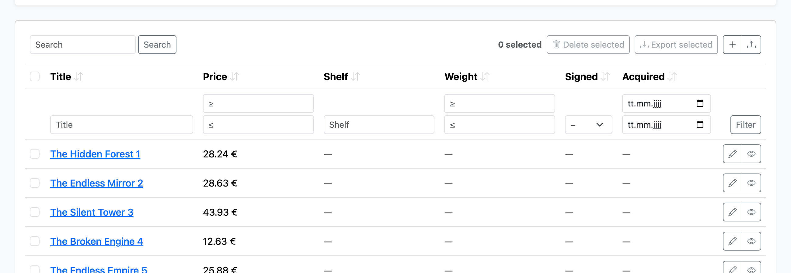
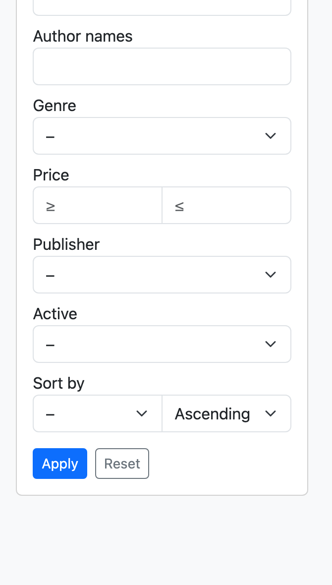

# Filtering & search

How a collection narrows its rows: the per-field `filter` facet, the search spec shared by
`filter` and `search_in`, typed filter controls for dynamic columns, and the standalone
`crud_filter` form. For how params reach SQL as a whole (the query tri-state) see
[views.md](views.md#the-query-tri-state); for the security rule ("only filter what you can
see") see [security.md](security.md).

> See it live: the [**filters demo**](https://crud-components.zelenin.de/books) (inline
> filter row + sidebar) and [**custom fields**](https://crud-components.zelenin.de/custom_fields)
> (typed controls on user-defined columns).

## The `filter` facet

Every column is filterable by default through the control its type implies — a string by
substring, a number/date by range, an enum/boolean by select. A computed or association
column opts in with the `filter` facet (a [search spec](#the-search-spec) or a block):

```ruby
attribute :author_names do
  render { |book| book.authors.map(&:name).to_sentence }
  filter authors: :name                       # spec: contains-match through the join
end

attribute :token, filter: false               # opt a derived field out of filtering
```

A `filter`/`search_in` block receives `(scope, value)` and returns a relation; the scope
arrives extended with `where_like` (see [the escape hatch](#the-escape-hatch)).

## Typed filter controls

A bare `filter: ->(scope, value) { … }` on a [dynamic column](fields.md#dynamic-columns)
always renders a **text box** and receives a raw string — fine for a substring match, but a
date or number column then filters worse than it renders. Wrap the apply block in a
`CrudComponents::TypedFilter`, built with a per-type helper, to get the control its type
wants:

```ruby
CrudComponents::TypedFilter.numeric(->(scope, geq:, leq:) { … })   # number range
CrudComponents::TypedFilter.numeric(->(scope, eq:) { … })          # single number field
CrudComponents::TypedFilter.date(->(scope, geq:, leq:) { … })      # date range
CrudComponents::TypedFilter.text(->(scope, contains:) { … })       # text box (substring)
CrudComponents::TypedFilter.boolean(->(scope, eq:) { … })          # yes / no / any
CrudComponents::TypedFilter.select(choices, ->(scope, eq:) { … })  # dropdown; choices = [[label, value], …] or a callable
```

The block declares which of `eq:` / `geq:` / `leq:` / `contains:` it handles and is called
with **only those** — each value already cast to the type (`numeric` → `BigDecimal`, `date`
→ `Date`, `boolean` → `true`/`false`), or `nil` when the param is blank or doesn't parse, so
junk never reaches SQL. The bare `?field=` value binds to `contains:` when the block asks for
it, otherwise to `eq:`; `?field_geq=` / `?field_leq=` bind to `geq:` / `leq:`.

**Which control renders follows from the type and the keywords the block declares.** A
`numeric`/`date` block that takes a bound (`geq:`/`leq:`) renders a range; one that takes only
`eq:` renders a single field. So the same declaration drives both the SQL and the UI — there's
no separate control to keep in sync.



The old `filter: ->(scope, value)` form keeps working unchanged (text box, substring). See
[`/custom_fields`](https://crud-components.zelenin.de/custom_fields) for one filter per flavor
(`test/dummy/app/models/property_definition.rb`).

## The search spec

One declarative mini-language for "case-insensitive contains across these columns,
joining as needed" — shared by `filter` (passed positionally) and `search_in`:

```ruby
filter :title                                  # own column
filter :title, :subtitle                       # several own columns, OR-combined
filter authors: %i[name email]                 # join, explicit columns
filter user: { address: %i[street town] }      # nested joins, explicit columns
filter :publisher                              # join, DELEGATE to Publisher's search_in
filter :title, { authors: :name }              # mixed
```

The **delegation form** — an association name *without* columns — means "search it the
way that model defines being searched" (its `search_in`). It is the idiomatic style and
stays correct as the target model's definition evolves.

The gem turns a spec into `left_joins` plus parameterized, wildcard-escaped `ILIKE`
(via `sanitize_sql_like` with an explicit `\` escape char, so `%`, `_` and `\` are all
literal). A spec contains only column/association names you wrote — **no SQL strings**,
nothing to sanitize. A joined match is `DISTINCT`; an own-column spec is not (no join to
dedupe). Delegation cycles are guarded (max 5 delegation hops) and raise rather than
stack-overflow.

### The escape hatch

A block is the escape hatch for genuinely custom logic; the scope it receives carries
the same machinery, so you keep the safe pit of success without `sanitize_sql_like`:

```ruby
filter do |scope, value|
  scope.where(active: true).where_like({ authors: :name }, value)
end
```

`where_like(spec, value)` is available on every scope handed to a filter/search block.
Raw SQL in a block is possible — and then explicitly your responsibility.

## The standalone filter form

`crud_collection` renders an inline filter row; `crud_filter` renders the same filters as a
**standalone form** (a sidebar or modal) you place yourself. It takes the same `extra_columns:`
as `crud_collection`, so a card grid gets its [dynamic-column](fields.md#dynamic-columns)
filters without hand-building a `Query`:

```erb
<%= crud_collection @books, layout: :cards, extra_columns: @columns %>
<%= crud_filter   Book, extra_columns: @columns, sort: true %>
```

A table carries sort links in its column headers, but a **headerless** surface (cards, a list)
has none — so pass **`sort: true`** to render a field + direction picker built from the query's
sortable fields. It submits `?sort=&dir=` with the rest of the form, needs no JavaScript, and is
opt-in (a table doesn't need it).



See it live on the [cards layout](https://crud-components.zelenin.de/books?layout=cards).

See also: [Fields & rendering](fields.md) · [Views & fieldsets](views.md) · [Security](security.md).
