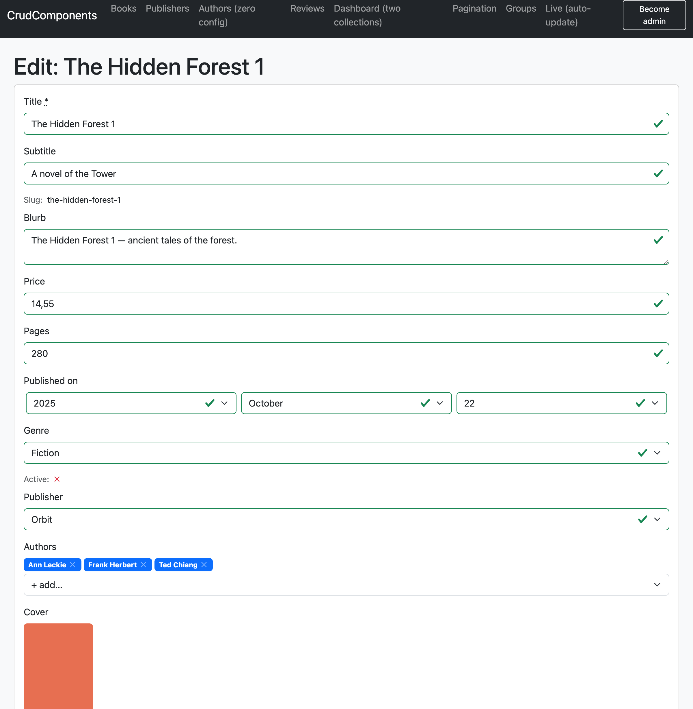

# Forms

`crud_form` derives a create/edit form from the same field metadata everything else uses.
The gem renders the form; **your controller saves it** — there is no gem-owned controller
and no gem-owned routes. The two are kept from drifting by a shared permit list.

```erb
<%= crud_form @book %>          <%# edit if persisted, new if not %>
```



## The permit list — why fields can't silently fail to save

The form and your strong-params both derive from the same metadata, so a field can't be
in one and missing from the other. Use the list the gem derived the form from:

```ruby
def book_params
  params.require(:book)
        .permit(*CrudComponents.permitted_attributes(Book, action: action_name.to_sym, ability: current_ability))
end
```

The classic "I added a field and it silently doesn't save" bug is structurally
impossible: the permit list *is* the form's field set, projected to param keys. For
models that don't `include CrudComponents::Model`, use
`CrudComponents.permitted_attributes(Model, action:, ability:)` — identical result.

What the list contains, per editable field:

| Field                                         | Permit key                        |
| --------------------------------------------- | --------------------------------- |
| column (string/number/date/boolean/enum/text) | `:name`                           |
| `belongs_to`                                  | `:publisher_id` (the foreign key) |
| habtm / has_many (ids)                        | `{ author_ids: [] }`              |
| single attachment                             | `:cover`                          |
| `has_many_attached`                           | `{ images: [] }`                  |

A `belongs_to` always permits the real foreign key (`:publisher_id`), never the slug —
even when the target uses `identify_by :slug`. A form POST is a request body, not a
shareable URL, so the slug buys nothing here (unlike a filter, which puts it in the URL);
see the mapping-table row below.

Excluded automatically: `id`, `created_at`, `updated_at`, computed fields (no form
control), JSON columns (read-only in v1), `has_many` that isn't habtm, and any field that
is non-editable or not permitted for the current user (below).

## Two permission dimensions

Editing introduces a question viewing doesn't: you may *see* a field but not be allowed
to *change* it. So `editable:` sits alongside `if:`:

```ruby
attribute :slug,           editable: false        # shown read-only in the form
attribute :state,          editable: :publish     # editable only if can?(:publish, Book)
attribute :purchase_price, if: :manage            # invisible to non-managers, everywhere
```

- **`if:`** controls **visibility** — a field you can't see isn't in the form, the permit
  list, the query, or any other surface.
- **`editable:`** controls **writability** — a visible-but-not-editable field renders as
  compact read-only text and is left out of the permit list. Same callable contract as
  `if:` (symbol → `can?`, zero-arity lambda, record lambda / `it`); see
  [Security → permissions](security.md#permissions).

Because both are enforced on the permit list *and* the form, the two can never disagree:
a user who can't edit a field can neither see an input for it nor smuggle it through
params.

## Which fields, and where it submits

Form field selection falls back **action → `:form` → `:default`**:

- `fieldset :form, %i[…]` — fields for all forms.
- `fieldset :edit, %i[…]` / `fieldset :new, %i[…]` — override one form (`:update` maps to
  `:edit`, `:create` to `:new`).
- otherwise the `:default` set is used.

New vs. edit (POST vs. PATCH) and the URL are inferred from the record (`persisted?`).
Override with `url:` / `method:` when routes aren't conventional:

```erb
<%= crud_form @book, url: publisher_book_path(@publisher, @book), method: :patch %>
```

## Rendering: simple_form

Forms render through [simple_form](https://github.com/heartcombo/simple_form) (a runtime
dependency). The gem decides *which* fields appear, their flavor, the permit list and the
read-only/permission logic; simple_form does the markup — labels, inputs, wrappers,
required marks, and **per-field error display** — through your app's wrapper config
(Bootstrap by default; the community ships Tailwind/Bulma/Foundation). So the gem's forms
inherit your design system automatically, and there's no hand-rolled `field_with_errors`
to fight.

The flavor → simple_form mapping (one `form_fields/_<type>` partial each):

| Field                             | simple_form call                                                                                                                                        |
| --------------------------------- | ------------------------------------------------------------------------------------------------------------------------------------------------------- |
| string / number / date / datetime | `f.input :name` (type inferred from the column)                                                                                                         |
| text                              | `f.input :name, as: :text`                                                                                                                              |
| boolean                           | `f.input :name, as: :boolean` (a checkbox; a *nullable* column renders a 3-state Yes / No / not-set select instead)                                     |
| enum                              | `f.input :name, collection: …` (your i18n'd keys; a *nullable* column adds a blank "not set" option)                                                    |
| `belongs_to`                      | `f.association :publisher, collection: …` — submits the real **id** (forms are POST bodies, not shareable URLs, unlike filters which use `identify_by`) |
| habtm                             | `f.association :authors, as: :select, multiple` + a `crud-multiselect` chip-picker hook (see below)                                                     |
| single / many attachment          | a file input + current preview + a "keep" checkbox per file (signed_id) — see [Attachments](#attachments)                                               |
| read-only (not editable)          | rendered by the gem as a compact `label: value`, not submitted                                                                                          |

Errors: simple_form shows per-field errors inline; the gem adds a summary for base
errors (`errors[:base]`) and any error on a column the form doesn't show, so "fix N
errors" is never a dead end (see [validation errors](#validation-errors) below).

To customise an input, override the per-type partial or point a single field at your own
(see [Customising an input](#customising-an-input) below) — or use simple_form's own
wrapper/component config, which the gem inherits.

## Associations and attachments

- **belongs_to** → a select valued by record id; permit `:publisher_id`.
- **habtm** → a `<select multiple>` baseline (works no-JS, scales) that carries
  `data-controller="crud-multiselect"`; permit `{ author_ids: [] }`. The optional
  `crud-multiselect` Stimulus controller (shipped by `crud_components:install`) replaces the
  select in place with a **chips-list + "add" dropdown** — the select stays the hidden source
  of truth, so the form submits identically with or without JS. This handles up to a few
  hundred options client-side.
  - **Thousands of options?** That needs an autocomplete querying *your* endpoint (the gem
    owns no controllers). Override the habtm input — drop a `form_fields/_habtm.html.erb`
    into your app, or set a different `as:`/`input_html` for that field — and point your
    library (tom-select, select2, a Stimulus+fetch) at your route. The param shape
    (`author_ids[]`) stays the same, so any library drops in.

### Attachments

Attachment inputs show the **current** file(s) — drawn by content type (image inline, a
previewable file like a PDF as a preview, anything else a **filetype icon + filename**) —
and support **keep / add / remove** through the standard permit list with **no controller
code**. The mechanism rests on one Active Storage fact: *an empty file input submits
nothing*, so leaving it empty keeps the current file(s).

- **single attachment** (`has_one_attached`) → permit `:cover`. Leave the file input empty
  to keep; choose a file to **replace**; tick **Remove** to delete (it submits a blank,
  which purges).
- **has_many_attached** → permit `{ images: [] }`. Each existing file has a **Keep**
  checkbox carrying its `signed_id` (untick to remove); the `multiple` file input adds. A
  hidden blank keeps the array present so unticking everything actually clears it. On save
  the set becomes exactly the kept ids + new uploads — see Rails'
  [Replacing vs Adding Attachments](https://guides.rubyonrails.org/active_storage_overview.html#replacing-vs-adding-attachments).
  Fully derived — see `Author` (`has_many_attached :images`) in the dummy app, *zero* config.

A plain `@record.update(permitted)` keeps / adds / removes correctly; you write no
attachment-specific controller code.

The non-image fallback icon is chosen by file extension via `config.file_icons` (a map of
extension → icon name, e.g. `'pdf' => 'filetype-pdf'`, `'zip' => 'file-earmark-zip'`),
falling back to `config.file_fallback_icon`. The icon *library* is the `icon_prefix` entry
in the [class map](extending.md#styling). Add or remap an extension in the config, or
override `crud_components/fields/_attachment_thumb.html.erb` to change the markup.

## Customising an input

Each editable input is rendered through a per-type partial,
`crud_components/form_fields/_<type>.html.erb`, where `<type>` is the field's form control
(`string`, `number`, `date`, `datetime`, `text`, `boolean`, `enum`, `belongs_to`, `habtm`,
`file`). simple_form still does the markup *inside* each partial. Two override levers,
plus the escape hatch:

- **A whole type** — drop a same-named partial into your app
  (`app/views/crud_components/form_fields/_enum.html.erb`); Rails view-path precedence picks
  yours. Every enum input now uses it.
- **One field** — `attribute :blurb, form_as: :rich_text` points just that field at
  `form_fields/_rich_text.html.erb`. `form_as:` is the form-side parallel of `as:` (which
  picks the read-only/display renderer) and defaults to the field's type. The partial
  receives the simple_form builder `f`, the `field`, and `form`.
- **Everything** — override `crud_components/_form.html.erb` to take over form rendering
  entirely.

(There is deliberately no `form` facet — `render`/`filter`/`sort` facets are unchanged;
forms customise through partials instead.)

## Validation errors

Validations live on your model; the gem re-renders the form correctly after a failed
save. Your controller renders the form again with the invalid record and a 422:

```ruby
def update
  @book = find_book
  if @book.update(book_params)
    redirect_to @book
  else
    render :edit, status: :unprocessable_entity   # crud_form @book re-renders with errors
  end
end
```

On that re-render:

- **Entered values are kept** — `simple_form_for` reads the in-memory record, which holds
  the submitted (invalid) attributes, so nothing the user typed is lost.
- **Per-field errors** render inline (simple_form, via your wrapper config — Bootstrap's
  `.invalid-feedback` by default).
- **Base / non-field errors** — `errors[:base]`, or errors on a column the form doesn't
  show — render in a summary at the top, so a counted error always has somewhere to be
  fixed.

## Scope (v1)

Single record; flat columns plus belongs_to and habtm. No nested forms /
`accepts_nested_attributes` and no JSON-column editing in v1.

## A complete example

```ruby
# app/models/book.rb
crud_structure do
  attribute :slug,  editable: false
  attribute :active, editable: :manage
  attribute :purchase_price, if: :manage
  fieldset :form, %i[title subtitle slug blurb price purchase_price pages
                     published_on genre active publisher authors cover]
end
```

```ruby
# app/controllers/books_controller.rb
def new   = (@book = Book.new)
def edit  = (@book = Book.find_by!(slug: params[:id]))
def create
  @book = Book.new(book_params)
  @book.save ? redirect_to(@book) : render(:new, status: :unprocessable_entity)
end
def update
  @book.update(book_params) ? redirect_to(@book) : render(:edit, status: :unprocessable_entity)
end

private

def book_params
  params.require(:book).permit(*CrudComponents.permitted_attributes(Book, action: action_name.to_sym, ability: self))
end
```

```erb
<%# app/views/books/edit.html.erb %>
<%= crud_form @book %>
```

`slug` shows read-only; `active` is an input only for managers (read-only otherwise);
`purchase_price` is absent entirely for non-managers — in the form *and* the permit list.

See also: [Fields & rendering](fields.md) · [Views](views.md) · [Security](security.md) ·
[Extending](extending.md).
