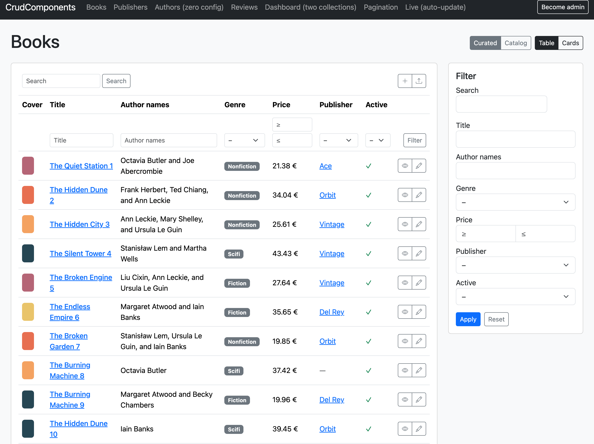
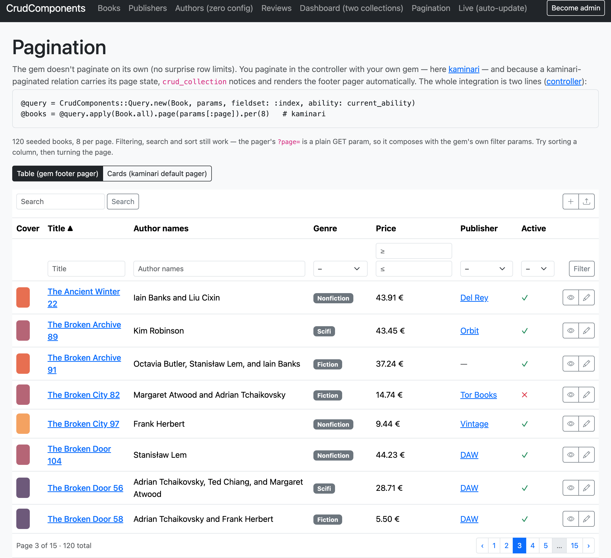
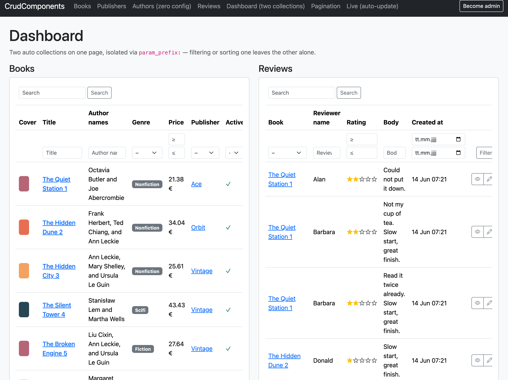

# Views: rendering, fieldsets, actions

The render-side reference: the four helpers, how a collection's query is built, fieldsets
(which fields/actions appear where), actions and route resolution, and rendering several
collections on one page. For pagination and the manual `Query` object see the bottom of
this doc.

## The helpers



```ruby
crud_collection(records_or_model, fieldset: nil, as: :table, query: nil,
                param_prefix: nil, actions: true)
crud_record(record, fieldset: nil, actions: true)
crud_filter(model, fieldset: nil, query: nil, param_prefix: nil)
crud_form(record, fieldset: nil, action: nil, url: nil, method: nil)   # see forms.md
crud_actions(record_or_model, fieldset: nil)
```

A bare model class is sugar for its `all` relation: `crud_collection Book` ≡
`crud_collection Book.all`.

```erb
<%= crud_collection @books %>                 <%# table; layout + filters + query derived %>
<%= crud_record @book %>                       <%# definition list, same cell renderers %>
<%= crud_filter Book %>                         <%# standalone labelled filter form %>
<%= crud_actions @book %>                       <%# just the row actions, for manual placement %>
```

## The query tri-state

`crud_collection`'s `query:` argument controls how a collection gets its records:

| `query:` | Mode | Behavior |
| --- | --- | --- |
| *not given* | **auto** | the helper reads the request params (and `current_ability` if defined), builds a `Query`, and applies it to the records. Zero controller code |
| a `Query` | **manual** | the records are taken as *already filtered*; the query supplies control state (sort links, filter values) and the helper inherits its fieldset. This is how you paginate — see below |
| `false` | **static** | no filter row, no sort links, params ignored. What an embedded secondary table usually wants |

> **One auto collection per page.** Auto mode reads the shared, flat request params, so
> two auto collections would both answer to `?sort=…` / `?q=`. Use `param_prefix:` or
> `query: false` for the second — see [Several collections on one page](#several-collections-on-one-page).

## Fieldsets

A **fieldset** is a named selection of fields and actions — never a definition.
Definitions are model-global; fieldsets say what appears where. It is deliberately *not*
called a "view": table vs. list is a *layout* (`as:`), picked at the render site; a
fieldset says *which fields*, and the same fieldset can feed a table today and cards
tomorrow.

```ruby
fieldset :default,   %i[cover title genre price publisher]
fieldset :catalog,   %i[cover title authors price published_on active],
         actions: %i[preview edit destroy]
fieldset :compact,   %i[title price]
fieldset :index,     %i[cover title price], filters: %i[genre published_on]
```

```erb
<%= crud_collection @books, fieldset: :catalog %>
<%= crud_record @book, fieldset: :compact %>
<%= crud_filter Book, fieldset: :catalog %>
```

Resolution, in full:

- Every model has an implicit `fieldset :default` = **all** fields + the default actions.
  Declaring `fieldset :default, …` overrides it. `fieldset :default, []` is the off
  switch (no columns).
- `crud_collection` uses `:index` if declared, else `:default`. `crud_record` uses
  `:show` if declared, else `:default`. `:index`/`:show` are conventions, not magic —
  any name is a fieldset.
- An explicitly requested fieldset must exist: `fieldset: :catalogue` raises, listing the
  fieldsets that do (typo protection). A fieldset referencing an unknown field or action
  raises at boot.

### Filterability follows the fieldset

**You can only filter and sort what you can see.** A curated table ignores params for
fields it doesn't show — otherwise hidden data could be probed through the URL (filter by
an invisible `purchase_price` and bisect to its value by watching which rows survive; see
[security](security.md)). When a surface should offer *more* filters than columns, say so
explicitly with `filters:`:

```ruby
fieldset :index, %i[cover title price], filters: %i[genre published_on]
```

`filters:` extends the fieldset's filterable set (sorting stays strictly visible fields);
`crud_filter` renders all of them.

### Layout is a separate axis

```erb
<%= crud_collection @books, fieldset: :catalog, as: :table %>   <%# default %>
<%= crud_collection @books, fieldset: :catalog, as: :cards %>   <%# a custom layout %>
```

v1 ships `:table`. A `:list`, `:cards` or `:map` layout plugs in without touching any
model — see [Extending → layouts](extending.md#add-a-layout). Selection (fieldset) and
arrangement (`as:`) are orthogonal: the same fieldset feeds any layout.

## Actions

Four actions exist by default: **`:new`** (collection), **`:show`**, **`:edit`** and
**`:destroy`** (per row; destroy is a DELETE with a confirm dialog).

`:show` is special: it renders only when the record isn't already reachable through a
label link in the same row — never two ways to the same page, always at least one.

Defaults are **self-disabling**: a derived action renders only if it is permitted
(`can?(:edit, record)` when an ability is around) *and* its conventional route resolves.
A model without RESTful routes simply gets no buttons — never a broken link.

### Route resolution

Resolution tries the most specific conventional route first and falls back outward:

- A collection built from an association — `crud_collection @publisher.books` — prefers
  nested routes: `edit_publisher_book_path(publisher, book)`, then `edit_book_path(book)`,
  then the button is omitted.
- Cells linking to associated records resolve the same way: a review in a book's row
  tries `book_review_path(book, review)`, then `review_path(review)`, then plain text.
- The label cell links through the same `show` → `:edit` chain; if the label field isn't
  in the fieldset, there is no implicit link — which is exactly when the derived `:show`
  button appears instead.
- A has_many "+n more" link points at the nested index (`publisher_books_path(owner)`)
  if it resolves, else the target's filtered index (`books_path(publisher: owner)`), else
  plain text.

### Declaring actions

```ruby
action :preview, icon: 'eye' do |book|
  book_preview_path(book)
end

action :import, on: :collection, icon: 'upload' do
  import_books_path
end
```

The block is the path, run in the [view context](fields.md#custom-markup) with the record
(for row actions). Keywords:

| Keyword | Meaning | Default |
| --- | --- | --- |
| `icon:` | icon name | derived for `new/show/edit/destroy` |
| `title:` | button text | i18n lookup, humanized fallback |
| `class:` | CSS classes | from the [class map](extending.md#styling) |
| `confirm:` | `true` or a message | `true` for `:destroy`, else off |
| `method:` | HTTP method | `:delete` for `:destroy`, else GET |
| `on:` | `:row` or `:collection` | `:row` (`:new` is `:collection`) |
| `if:` | permission callable | `can?(name, record)` when an ability is present |

A fieldset's `actions:` is authoritative *per kind*: `actions: %i[preview edit destroy]`
curates the row buttons without losing the derived `:new`; `actions: []` hides
everything.

### Placement

Collection actions render in the collection header; row actions in the rightmost column;
`crud_record` shows the row actions above the definition list. Pass `actions: false` to
any helper and place them yourself:

```erb
<%= crud_actions @book %>    <%# the row actions of one record %>
<%= crud_actions Book %>     <%# the collection actions %>
```

For a fully custom actions cell, a fieldset can name a partial instead of a list — it
receives `record`:

```ruby
fieldset :index, %i[cover title price], actions: 'books/actions'
```

## The manual query, pagination, and big tables



By default `crud_collection` renders **everything that matches**. For large tables, take
the query into your own hands — the explicit form of what the helper does automatically:

```ruby
# controller
@query = CrudComponents::Query.new(Book, params, fieldset: :catalog, ability: current_ability)
@books = @query.apply(Book.accessible_by(current_ability)).page(params[:page])  # kaminari/pagy
```

```erb
<%= crud_collection @books, query: @query %>   <%# records already filtered; footer pager renders itself %>
```

Everything stays an ActiveRecord relation, so any paginator and any pre-existing scope
compose. The manual query is also how you get the filtered relation for counts, CSV
exports, or charts.

**The footer pager renders itself** when the relation you pass is already paginated —
i.e. you called `.page` and it decorates the relation (kaminari, will_paginate). The gem
never paginates on its own (no surprise row limits); it only *notices* that you did and
draws a Bootstrap pager whose links preserve the active filters, search, sort and any
other collection's params (so it respects `param_prefix:`). Restyle it by overriding
`crud_components/_pager.html.erb` or the `css.pagination` class.

> **pagy** keeps its state in a separate `@pagy` object rather than on the relation, so
> there's nothing for the gem to detect — render `<%= pagy_nav(@pagy) %>` yourself after
> `crud_collection`.

`page`/`per` are reserved params (with `q`/`sort`/`dir`), so the pager's `?page=` never
collides with a filter. With `param_prefix: :books`, the page param is `books_page` —
read it in the controller (`.page(params[:books_page])`).

### Several collections on one page



- **`query: false`** — a static collection (no filter row, no sort links, params ignored).
  Usually right for a secondary table ("books by this publisher", embedded on the
  publisher page).
- **`param_prefix:`** — a flat param namespace of its own:
  `crud_collection @books, param_prefix: :books` reads `?books_title=…`, `?books_q=…`,
  `?books_sort=…` and ignores everything unprefixed. URLs stay flat and shareable.

## Turbo Streams

Rows carry `dom_id`s and render independently, so the markup is morph- and
stream-friendly out of the box. Add Rails' own `broadcasts_refreshes` to the model and a
`turbo_stream_from` subscription to the page, and a collection updates live — only the
changed rows morph, the rest stay put. The gem ships no streaming machinery; it just
guarantees the markup a broadcast (or Turbo morph refresh) needs. The dummy app's "Live"
page demonstrates it.

See also: [Fields & rendering](fields.md) · [Forms](forms.md) · [Security](security.md).
