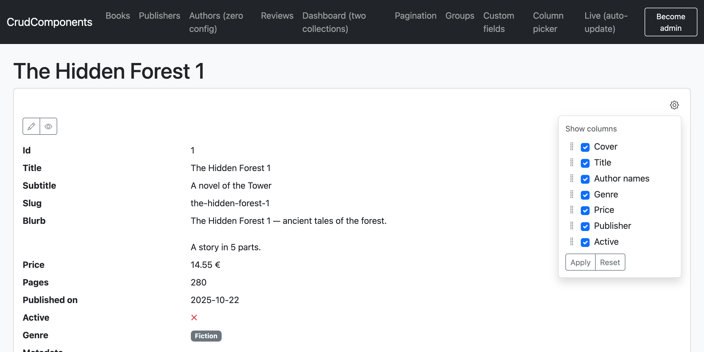

# Views: rendering, fieldsets, actions

> See it running: **[live demo](https://crud-components.zelenin.de)** — every feature has a page with the DSL behind it.

The render-side reference: the four helpers, how a collection's query is built, fieldsets
(which fields/actions appear where), actions and route resolution, and rendering several
collections on one page. For pagination and the manual `Query` object see the bottom of
this doc.

## The helpers


```ruby
crud_collection(records, fieldset: nil, layout: :table, query: :auto, param_prefix: nil,
                actions: true, group_by: nil, extra_columns: nil, picker: false, picked_columns: :auto)
crud_record(record, fieldset: nil, actions: true, layout: :record, picked_columns: :auto)
crud_filter(model, fieldset: nil, query: nil, param_prefix: nil, extra_columns: nil, sort: false, layout: :filter)
crud_form(record, fieldset: nil, action: nil, url: nil, method: nil, layout: :form)   # see forms.md
crud_actions(record_or_model, fieldset: nil)   # a record → row actions; a model class → collection actions
```

`crud_collection` takes a relation — pass `Book.all`, `@books`, or
an authorized scope such as `Book.accessible_by(current_ability)`. (`crud_filter` takes the model class — it's
a filter form, not a set of records.)

```erb
<%= crud_collection @books %>                 <%# table; layout + filters + query derived %>
<%= crud_record @book %>                       <%# definition list, same cell renderers %>
<%= crud_filter Book %>                         <%# standalone labelled filter form %>
<%= crud_actions @book %>                       <%# just the row actions, for manual placement %>
<%= crud_actions Book %>                         <%# the collection actions (model class), for manual placement %>
```

## The query tri-state

`crud_collection`'s `query:` argument controls how a collection gets its records:

| `query:`    | Mode       | Behavior                                                                                                                                                                                                    |
| ----------- | ---------- | ----------------------------------------------------------------------------------------------------------------------------------------------------------------------------------------------------------- |
| *not given* | **auto**   | the helper reads the request params (and `current_ability` if defined), builds a `Query`, and applies it to the scope you pass. The only controller code is assigning that scope (e.g. `@books = Book.all`) |
| a `Query`   | **manual** | the records are taken as *already filtered*; the query supplies control state (sort links, filter values) and the helper inherits its fieldset. This is how you paginate — see below                        |
| `false`     | **static** | no filter row, no sort links, params ignored. What an embedded secondary table usually wants                                                                                                                |

> **One auto collection per page.** Auto mode reads the shared, flat request params, so
> two auto collections would both answer to `?sort=…` / `?q=`. Use `param_prefix:` or
> `query: :static` for the second — see [Several collections on one page](#several-collections-on-one-page).

## Fieldsets

A **fieldset** is a named selection of fields and actions.
Definitions are model-global; fieldsets say what appears where. It is deliberately *not*
called a "view": table vs. list is a *layout* (`as:`), picked at the render site; a
fieldset says *which fields*, and the same fieldset can feed a table today and cards
tomorrow.

```ruby
fieldset :default,   %i[cover title genre price publisher]
fieldset :catalog,   %i[cover title authors price published_on active],
         actions: %i[preview edit destroy]
fieldset :compact,   %i[title price]
fieldset :index,     %i[cover title price], filters: %i[genre published_on]
```

```erb
<%= crud_collection @books, fieldset: :catalog %>
<%= crud_record @book, fieldset: :compact %>
<%= crud_filter Book, fieldset: :catalog %>
```

Resolution, in full:

- Every model has an implicit `fieldset :default` = **all** fields + the default actions.
  Declaring `fieldset :default, …` overrides it. `fieldset :default, []` is the off
  switch (no columns).
- `crud_collection` uses `:index` if declared, else `:default`. `crud_record` uses
  `:show` if declared, else `:default`. `:index`/`:show` are conventions, not magic —
  any name is a fieldset.
- An explicitly requested fieldset must exist: `fieldset: :catalogue` raises, listing the
  fieldsets that do (typo protection). A fieldset referencing an unknown field or action
  raises at boot.

### Filterability follows the fieldset

**You can only filter and sort what you can see.** A curated table ignores params for
fields it doesn't show — otherwise hidden data could be probed through the URL (filter by
an invisible `purchase_price` and bisect to its value by watching which rows survive; see
[security](security.md)). When a surface should offer *more* filters than columns, say so
explicitly with `filters:`:

```ruby
fieldset :index, %i[cover title price], filters: %i[genre published_on]
```

`filters:` extends the fieldset's filterable set (sorting stays strictly visible fields);
`crud_filter` renders all of them.

The standalone `crud_filter` form takes `extra_columns:` (for dynamic-column filters) and
`sort: true` (a sort picker for headerless surfaces) — see
[Filtering → the standalone form](filtering.md#the-standalone-filter-form).

### Layout is a separate axis

```erb
<%= crud_collection @books, fieldset: :catalog, layout: :table %>   <%# default %>
<%= crud_collection @books, fieldset: :catalog, layout: :cards %>   <%# a custom layout %>
```

The gem ships with `:table`. If you want to use a different layout, you can add it by creating a partial in your app at `app/views/crud_components/layouts/_<layout_name>.html.erb`. See [Extending → layouts](extending.md#add-a-layout). Selection (fieldset) and
arrangement (`layout:`) are orthogonal: the same fieldset feeds any layout. (`crud_record`,
`crud_filter` and `crud_form` take `layout:` too — the partial each renders, defaulting to
`:record`/`:filter`/`:form`.)

## Column picker

A fieldset is the app's default set of columns. A column picker lets each user choose
which of those columns they want to see, and in what order. It's **two knobs**: `picker:`
turns the gear on, `picked_columns:` decides what it's seeded with.

```erb
<%= crud_collection @books, fieldset: :index, picker: true %>
```

`picker: true` renders a **gear** in the header row's actions cell. With the default
`picked_columns: :auto` the gem reads the `?cols=` selection the gear submits — ephemeral,
nothing stored. It opens a checklist of every column the user may see —
declared columns, [dynamic columns](fields.md#dynamic-columns) and
[path columns](fields.md#path-columns) (`authors.email` & co.) alike — each a checkbox,
draggable to reorder.

**Columns are grouped by their source model**, Pipedrive-style: this model's own columns
first (under a "Book" heading), then each associated model — `publisher`, `publisher.name`
and `publisher.founded_on` cluster under **Publisher** (with its [icon](fields.md#identity-label-identify_by-search_in-icon)),
`authors.name`/`authors.email` under **Author** — and every row also tags its model on the
right, so a long list stays scannable.

The picker is **just another query param**. Its form submits `?cols[]=` to the same URL —
exactly like the sort links and filter row — so it composes with filters, search, sort and
`param_prefix:`, and the selection rides in the URL with nothing stored server-side.

**No JavaScript required.** The gear is a native `<details>`/`<summary>` disclosure, so it
opens and closes without JS; ticking columns is plain HTML, and Apply/Reset are a plain GET.
The optional `crud-columns` Stimulus controller adds drag-to-reorder and collapses the
`?cols[]=a&cols[]=b` array into a tidier `?cols=a,b` (the server reads both forms).

### A persisted selection

For an ephemeral picker you're done — leave `picked_columns: :auto` and the gem reads the
param. To make a choice **stick across visits**, your controller resolves it (from the
param, from storage) and passes the result as an **Array**. The gem then shows exactly that
and **never re-reads `?cols=`** — one place owns the selection, no split-brain.

```erb
<%# nil → :auto until the first pick is stored, then an Array %>
<%= crud_collection @books, picker: true, picked_columns: current_user.book_columns %>
```

The two knobs are independent: **`picker:`** only decides whether the gear is rendered here;
**`picked_columns:`** is the selection and applies on its own. So an `Array` narrows even with
no gear here (the gear may be a standalone picker elsewhere), and `:auto` only reads `?cols=`
when there *is* a gear here — otherwise a stray param is ignored.

| `picker:` | `picked_columns:` | Gear | Shows |
| --- | --- | --- | --- |
| `false` (default) | `:auto` (default) | no | the fieldset's columns (a stray `?cols=` is ignored) |
| `false` | `%i[…]` (Array) | no | exactly this selection (gear lives elsewhere; param not read) |
| `true` | `:auto` (default) | yes | `?cols=` if present, else all columns |
| `true` | `%i[…]` (Array) | yes | exactly this selection (the param is **not** read) |

The chosen names are always **intersected with the permitted set**: a forged or stale
`?cols=` (or a `picked_columns:` Array naming a column the user lost access to) can only
hide or reorder columns, never reveal one the `if:` gate forbids. See [security](security.md).

### Reuse anywhere with `crud_column_picker`



The gear is also a standalone helper, so you can place it outside a table — e.g. above a
`crud_record` detail view. A detail view has no inline gear of its own (no `picker:` knob);
resolve the selection in the controller and pass it as `picked_columns:`:

```erb
<%# controller: @visible = CrudComponents.selected_columns(params) %>
<%= crud_column_picker @book, fieldset: :show %>          <%# the gear, submits ?cols= to this page %>
<%= crud_record @book, picked_columns: @visible %>        <%# narrows/orders the dl to match (nil → :auto → all) %>
```

`crud_column_picker` takes a relation, a model class or a record. Match its `param_prefix:`
to the consuming `crud_collection`/`crud_record` so they read the same param.

**Persistence is yours, and optional.** The gem reads the param; it doesn't store it. Use
`CrudComponents.selected_columns(params)` to pull the ordered selection out of a request
(it honors `param_prefix:` and accepts both the `cols[]` and `cols=a,b` forms), save it
wherever you keep per-user state, and pass it back via `picked_columns:`. The block form
runs only when the picker was actually submitted:

```ruby
def index
  CrudComponents.selected_columns(params) { |cols| current_user.update!(book_columns: cols) }
  @books = Book.all
end
# view: crud_collection @books, picker: true, picked_columns: current_user.book_columns
```

The `/columns` page in `test/dummy` is a runnable example.

## Actions

Four actions exist by default: **`:new`** (collection), **`:show`**, **`:edit`** and
**`:destroy`** (per row; destroy is a DELETE with a confirm dialog).

`:show` is special: it renders only when the record isn't already reachable through a
label link in the same row — never two ways to the same page, always at least one.

Defaults are **self-disabling**: a derived action renders only if it is permitted
(`can?(:edit, record)` when an ability is around) *and* its conventional route resolves.
A model without RESTful routes simply gets no buttons.

### Route resolution

Resolution tries the most specific conventional route first and falls back outward:

- A collection built from an association — `crud_collection @publisher.books` — prefers
  nested routes: `edit_publisher_book_path(publisher, book)`, then `edit_book_path(book)`,
  then the button is omitted.
- Cells linking to associated records resolve the same way: a review in a book's row
  tries `book_review_path(book, review)`, then `review_path(review)`, then plain text.
- The label cell links through the same `show` → `:edit` chain; if the label field isn't
  in the fieldset, there is no implicit link — which is exactly when the derived `:show`
  button appears instead.
- A has_many "+n more" link points at the nested index (`publisher_books_path(owner)`)
  if it resolves, else the target's filtered index (`books_path(publisher: owner)`), else
  plain text.

### Declaring actions

```ruby
action :preview, icon: 'eye' do |book|
  book_preview_path(book)
end

action :import, on: :collection, icon: 'upload' do
  import_books_path
end
```

**Button text** comes from i18n: `t("crud_components.actions.#{name}")`, humanized fallback.
The gem ships English and German defaults for the four built-in actions (`new`/`show`/`edit`/`destroy`);
override any of them, or add your own custom actions, in your app's `config/locales`.

**Icons** are [Bootstrap Icons](https://icons.getbootstrap.com) by default, rendered as
`#{css.icon_prefix}#{icon}` (`icon_prefix` defaults to `'bi bi-'`). Use any library by
setting it in the [class map](extending.md#styling), e.g. `config.css.icon_prefix = 'fa fa-'`
for Font Awesome — the icon *names* differ per library, so adjust those too.

The block is the path, run in the [view context](fields.md#custom-markup) with the record
(for row actions). Keywords:

| Keyword    | Meaning                 | Default                                         |
| ---------- | ----------------------- | ----------------------------------------------- |
| `icon:`    | icon name               | derived for `new/show/edit/destroy`             |
| `title:`   | button text             | i18n lookup, humanized fallback                 |
| `class:`   | CSS classes             | from the [class map](extending.md#styling)      |
| `confirm:` | `true` or a message     | `true` for `:destroy`, else off                 |
| `method:`  | HTTP method             | `:delete` for `:destroy`, else GET              |
| `on:`      | `:row` or `:collection` | `:row` (`:new` is `:collection`)                |
| `if:`      | permission callable     | `can?(name, record)` when an ability is present |

A fieldset's `actions:` is authoritative *per kind*: `actions: %i[preview edit destroy]`
curates the row buttons without losing the derived `:new`; `actions: []` hides
everything.

### Placement

Collection actions render in the collection header; row actions in the rightmost column;
`crud_record` shows the row actions above the definition list. Pass `actions: false` to
any helper and place them yourself:

```erb
<%= crud_actions @book %>    <%# the row actions of one record %>
<%= crud_actions Book %>     <%# the collection actions (a model class) %>
```

For a fully custom actions cell, a fieldset can name a partial instead of a list — it
receives `record`:

```ruby
fieldset :index, %i[cover title price], actions: 'books/actions'
```

## Grouping

`group_by:` is a render-time *arrangement*, like the layout (`as:`) — not part of
the fieldset (which is *what* shows) or the model. Pass it on the render call:

```erb
<%= crud_collection @books, group_by: :publisher %>   <%# belongs_to, enum or a column %>
```

The gem orders the relation by the group key first (your column sort applies *within*
each group), splits the rows into groups, and renders a header row per group — a chevron,
the group label (a `belongs_to`'s `label`, an enum's i18n value, or the column value) and a
count. A nil value forms a trailing "—" group.

Collapse state is a plain GET param, `?open=tor-books,ace`, so a half-expanded view is
copy-pasteable and works without JavaScript (each chevron is a link that toggles its key).
By default every group opens when the total row count is below
`config.group_collapse_threshold` (50); above it only the first opens. Once `?open=` is set
it is authoritative (and may open several).

Grouping applies to the rendered set, so with pagination it groups per page — typically you
group *instead of* paging. The key must be a column, `belongs_to` or enum (something with a
SQL column to order by); anything else raises at render.

## Selection (bulk actions)

Declare a bulk action with `on: :selection` and the verb it uses:

```ruby
action :delete_selected, on: :selection, method: :delete, confirm: true do
  delete_selected_books_path
end
action :export_selected, on: :selection do export_selected_books_path end   # GET
```

The table then grows a checkbox column and toolbar buttons. Ticked rows submit their
`identify_by` values as `selected[]=<slug>` to the action's path with the declared method
(POST/DELETE get a confirm and a global CSRF token; GET just navigates). It is one external
`<form>` — the checkboxes bind via the HTML `form` attribute (the same trick as the inline
filter row), and each button targets its action via `formaction`/`formmethod`. **No
JavaScript required**; the optional `crud-select` controller adds "select all" (visible
rows), per-group selection and a live count.

Your controller resolves the selection with one helper — the gem owns no controllers, so
you choose the scope and the verb:

```ruby
def delete_selected
  books = Book.accessible_by(current_ability)         # the same scope you'd render
  CrudComponents.selected(books, params).destroy_all  # narrows within it
  redirect_to books_path
end
```

`CrudComponents.selected(scope, params)` turns `selected[]` into
`scope.where(identify_by => …)`. **Pass the authorized scope you render**, not the bare
model — selection narrows *within* it, so a tampered slug can never reach a row outside it.
(A model class also works, e.g. `CrudComponents.selected(Book, params)`, when you don't
scope and mean the whole table.) There is **no "select all" flag** — selection always
enumerates the chosen rows, so a stray param can never act on the whole table; "select all"
is purely the JS convenience of ticking the visible boxes.

## The manual query, pagination, and big tables


By default `crud_collection` renders **everything that matches**. For large tables, take
the query into your own hands — the explicit form of what the helper does automatically:

```ruby
# controller
@query = CrudComponents::Query.new(Book, params, fieldset: :catalog, ability: current_ability)
@books = @query.apply(Book.accessible_by(current_ability)).page(params[:page])  # kaminari
```

```erb
<%= crud_collection @books, query: @query %>   <%# records already filtered; footer pager renders itself %>
```

Everything stays an ActiveRecord relation, so any paginator and any pre-existing scope
compose. The manual query is also how you get the filtered relation for counts, CSV
exports, or charts. To permit the query's params yourself or rebuild filter-preserving
links by hand, the query exposes the params it reads — see
[the params a query reads](filtering.md#the-params-a-query-reads).

**The footer pager renders itself** when the relation you pass is already paginated —
i.e. you called `.page` and it decorates the relation (kaminari, will_paginate). The gem
never paginates on its own (no surprise row limits); it only *notices* that you did and
draws a Bootstrap pager whose links preserve the active filters, search, sort and any
other collection's params (so it respects `param_prefix:`). Restyle it by overriding
`crud_components/_pager.html.erb` or the `css.pagination` class.

> **pagy** keeps its state in a separate `@pagy` object rather than on the relation, so
> there's nothing for the gem to detect — render `<%= pagy_nav(@pagy) %>` yourself after
> `crud_collection`.

`page`/`per` are reserved params (with `q`/`sort`/`dir`), so the pager's `?page=` never
collides with a filter. With `param_prefix: :books`, the page param is `books_page` —
read it in the controller (`.page(params[:books_page])`).

### Several collections on one page


- **`query: :static`** — a static collection (no filter row, no sort links, params ignored).
  Usually right for a secondary table ("books by this publisher", embedded on the
  publisher page).
- **`param_prefix:`** — a flat param namespace of its own:
  `crud_collection @books, param_prefix: :books` reads `?books_title=…`, `?books_q=…`,
  `?books_sort=…` and ignores everything unprefixed. URLs stay flat and shareable.

## Turbo Streams

Rows carry `dom_id`s and render independently, so the markup is morph- and
stream-friendly out of the box. Add Rails' own `broadcasts_refreshes` to the model and a
`turbo_stream_from` subscription to the page, and a collection updates live — only the
changed rows morph, the rest stay put. The gem ships no streaming machinery; it just
guarantees the markup a broadcast (or Turbo morph refresh) needs. The dummy app's "Live"
page demonstrates it.

See also: [Fields & rendering](fields.md) · [Forms](forms.md) · [Security](security.md).
